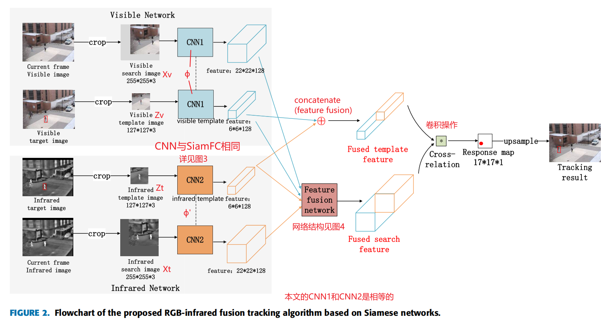
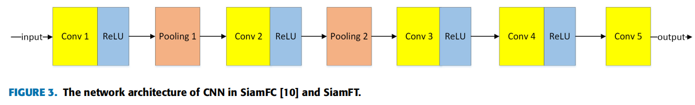
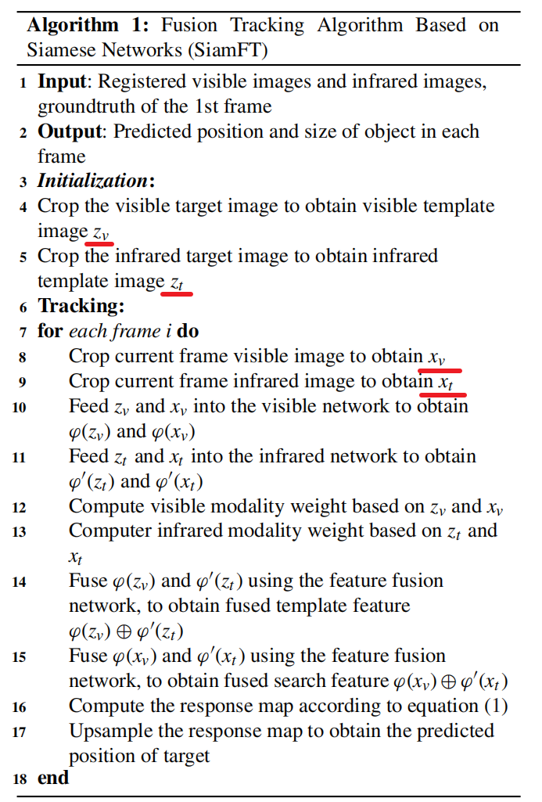
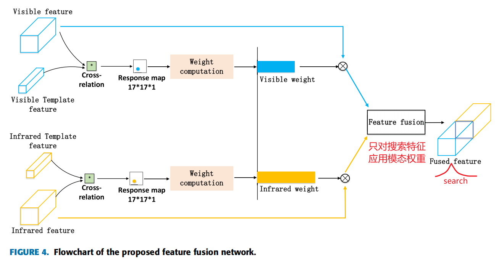

# SiamFT

> [!NOTE] 温馨提示
> 转载请标注来源哦~~

SiamFT 是基于 SiamFC 的多模态目标跟踪算法，使用经典的双分支网络结构，结合特征融合模块（后期融合策略）融合主干网络的特征，实现多模态目标跟踪。

论文地址见：[SiamFT: An RGB-Infrared Fusion Tracking Method via Fully Convolutional Siamese Networks](https://ieeexplore.ieee.org/document/8809774)

代码地址见：[SiamFT：通过完全卷积孪生网络进行的RGB红外融合跟踪方法_rgbt跟踪 CSDN博客](https://blog.csdn.net/qq_36449741/article/details/104610986?ops_request_misc=%7B%22request%5Fid%22%3A%22169304010816800222898153%22%2C%22scm%22%3A%2220140713.130102334..%22%7D&request_id=169304010816800222898153&biz_id=0&utm_medium=distribute.pc_search_result.none-task-blog-2~all~sobaiduend~default-1-104610986-null-null.142^v93^insert_down28v1&utm_term=SiamFT&spm=1018.2226.3001.4187)

## I. Introduction

主要贡献：

- 首次提出基于孪生网络的融合跟踪方法
- 首次提出基于孪生网络的模态权值计算方法，可见和红外图片的互补特征通过这个权重融合，以更好的利用多模态信息

## II. RELATED WORK（无关）

### A. 视觉目标跟踪（无关）

目前视觉目标跟踪主要基于**深度学习**和**相关滤波器**

- 深度学习的方法：强大的特征表征能力。但是在线更新很费时，所以通常采用离线训练
- 相关滤波器方法：性能略差于前者。但是计算效率高，可以在线更新

### B. IMAGE FUSION 图片融合（无关）

图像融合的目的是将来自多个图像的信息结合到单个图像中，能够为应用提供更好的数据源

图像融合算法：像素级、特征级和决策级的融合方法

图像融合和融合跟踪的目的不同

### C. RGB-INFRARED FUSION TRACKING

## III. PROPOSED METHODS

### A. 网络架构

<!--  -->

$$
responseMap=(\varphi(z_v)\oplus\varphi'(z_t))*(\varphi(x_v)\oplus\varphi'(x_t)) \tag{1}
$$

可见和红外图片的**特征首先被提取和融合，然后融合特征被跟踪器用来定位目标**。

相较于像素级的融合，该方法有两个优点：

- 这个方法融合了高级特征，计算效率更高。

- 该方法可以直接产生有效的特征表示，这对跟踪至关重要。

visible network 和 infrared network 有与SiamFC的CNN部分相同的结构，如图3（这个CNN是完全卷积的，因此对输入图像的大小没有任何限制的要求）

<!--  -->

特征融合网络考虑了模态的可靠性

<!--  -->

### B. FEATURE FUSION NETWORK

<!--  -->

1）MODALITY WEIGHT COMPUTATION

特征融合网络可以计算模态权重。

作者认为可靠图片的两个特点是：①他和模板图片有相似的特征 ②物体在连续两帧中移动不太快

权重计算公式如下：
$$
weight_i=\begin{cases}
max(R_i), \quad if \ d<threshold, \\
\frac{max(R_i)}{\sqrt{d}}, \quad if \ d\geq threshold
\end{cases} \tag{2}
$$
其中， $R$ 表示互相关计算得出的 response value，$d$ 表示连续两帧间预测目标位置间的距离。$i$ 表示模态（$t$ 是红外图像，$v$ 是可见光图像），$threshold$ 是实验得出的经验值。

然后把权重标准化/归一化：
$$
w_v = \frac{weight_v}{weight_v+weight_t}, \\
w_t = \frac{weight_t}{weight_v+weight_t}, \tag{3,4}
$$
2）FEATURE FUSION

对于模板特征不应用模态权重，融合后的模板特征为：
$$
\varphi(z_v) \oplus \varphi'(z_t) = concat(\varphi(z_v),\ \varphi'(z_t)) \tag{5}
$$
对于搜索特征应用模态权重，并且第二帧开始每一帧都更新权重：
$$
\varphi(x_v) \oplus \varphi'(x_t) = concat(w_v \times \varphi(x_v),\ w_t \times \varphi'(x_t)) \tag{6}
$$

## IV. EXPERIMENTS

### A. IMPLEMENTATION DETAILS

损失函数如下，对于response map $D$，$y[u]$是 labeled value，$v[u]$是 ground-truth value，D中的每个元素$u\in D$：
$$
L(y,v) = \frac{1}{|D|}\sum_{u\in D}log(1+exp(-y[u] \cdot v[u])) \tag{7}
$$
Siamese网络的参数 $\theta$ 通过对式7使用SGD获得。

### C. EVALUATION METRICS

使用成功率（SR）和精确率（PR）来评估融合跟踪性能。

- 成功（Success）是指预测框和真实框之间的overlap（就是 iou）大于一个阈值。

- 精确（Precision）是指预测框和真实框中心位置误差 the center location error (CLE) 小于一个阈值。

## VI. DISCUSSION

### B. INFRARED-SPECIFIC NETWORK

作者使用ImageNet训练网络，作者认为如果用红外图片微调 infrared network，将会进一步提升网络性能。

### C. FEATURE FUSION NETWORK

论文使用人工定义的权重，作者将会采用更智能的方法——例如设计子网络学习权重（我也是这么想的）