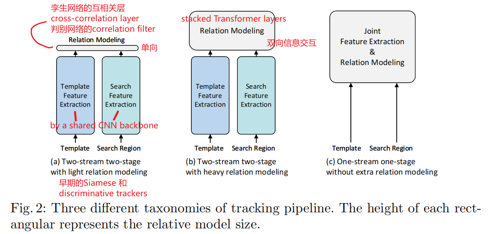
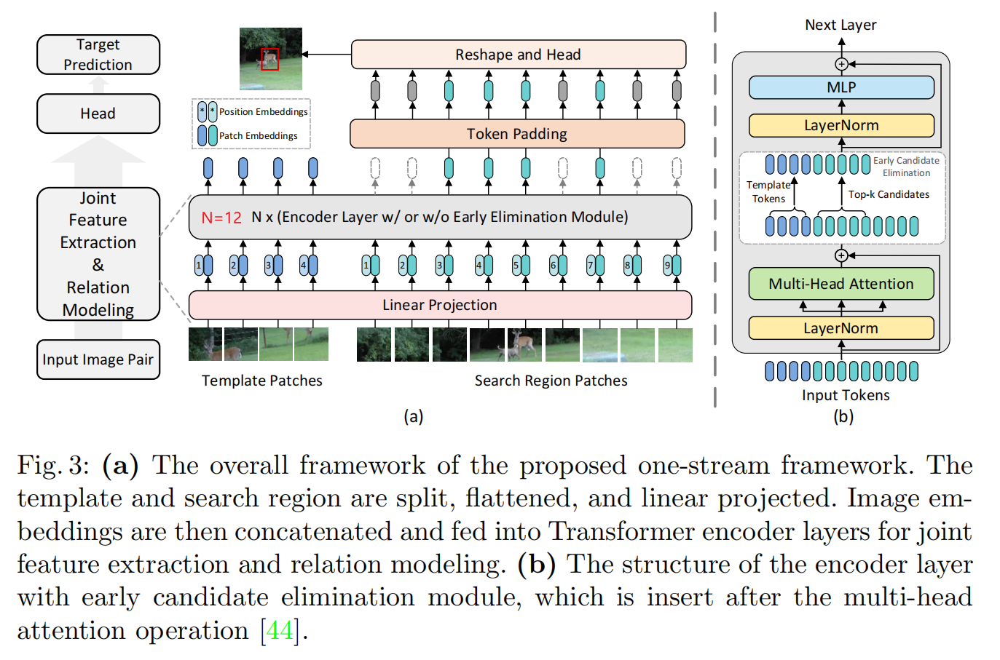
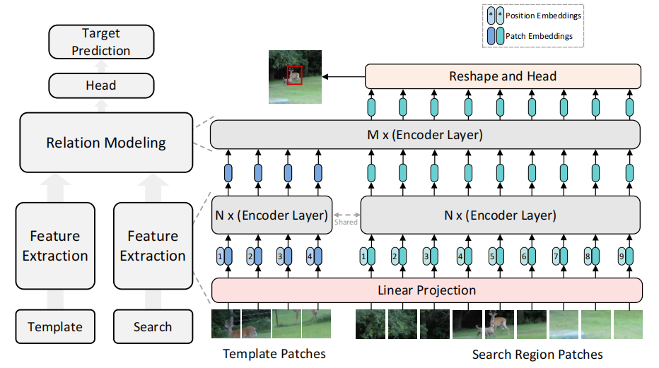
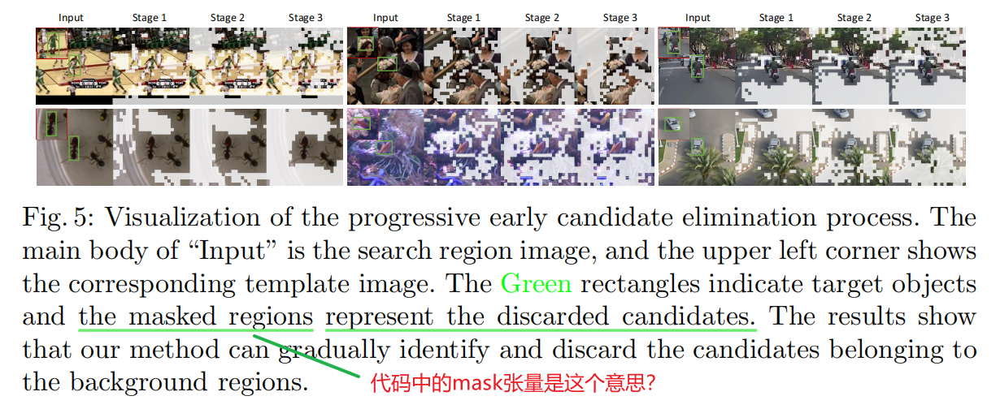
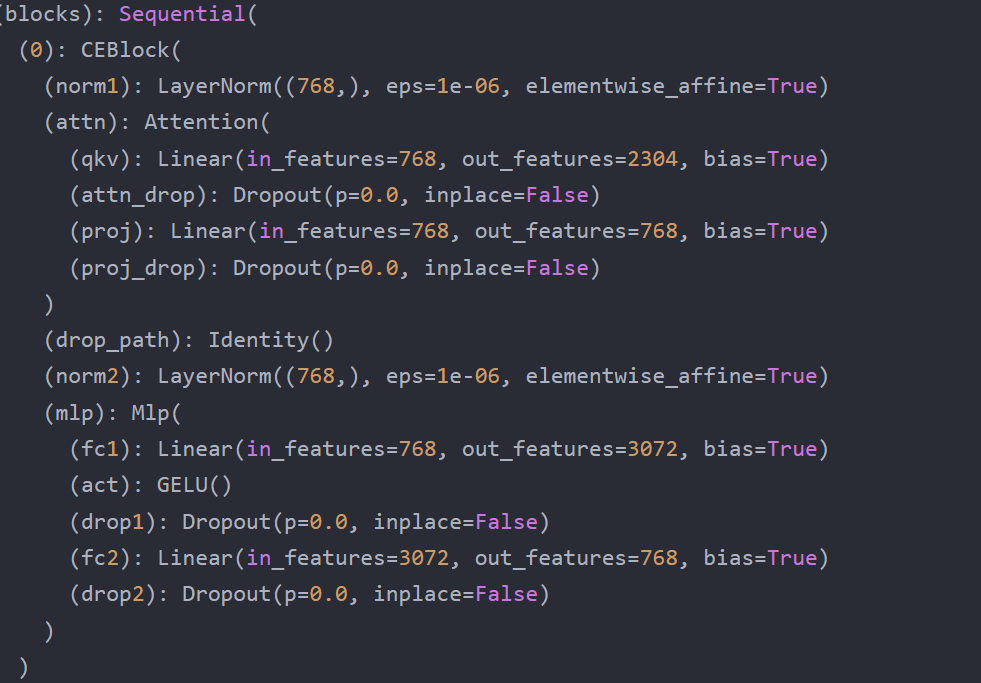

# OSTrack (ECCV 2022)

> [!NOTE] 温馨提示
> 转载请标注来源哦~~

Joint Feature Learning and Relation Modeling for Tracking: A One-Stream Framework

OSTrack 可谓是单目标跟踪领域的开创性工作之一，作者开创性地将特征提取和关系建模相结合，提出了一个单流单阶段的跟踪框架；并提出一个网络内的早期候选消除模块来减少推理时间。

代码和论文地址见：[Joint Feature Learning and Relation Modeling for Tracking: A One-Stream Framework](https://github.com/botaoye/OSTrack)

## 1 Introduction

提出**单流单阶段跟踪框架**（a unified *one-stream one-stage* tracking framework）

早期就在template和search region之间搭建一条信息流，从而提取了目标导向型的特征，避免了识别信息的丢失：

把展平的（flattened）template和search region拼接（*i.e*. concatenate，使框架高度并行化），然后送入自注意力层（staked self-attention layers广泛应用于Vision Transformer (ViT) ），产生的search region features可直接用作目标分类和回归。

这个单流框架能够在早期就区分目标和背景，这推动我们提出了**早期候选消除模块**，它简单高效。

主要贡献：

- 通过将特征提取和关系建模（应该是以往计算相似度的网络）相结合，提出了一种简单、整洁、有效的单流、单阶段跟踪框架。
- 基于目标与搜索区域各部分之间早期获得的相似度得分的先验，提出了一个网络内的早期候选消除模块来减少推理时间。

## 2 Related Work

### Tracking Pipelines

(b)中使用堆叠的Transformer层来关系建模，虽然表现提升但速度变慢，例如：

TransT [5] proposes to stack a series of self-attention and cross-attention layers for iterative feature fusion.

STARK [50] concatenates the pre-extracted template and search region features and feeds them into multiple self-attention layers.

我们的方法(c)提供了模板和搜索区域之间的自由信息流，计算成本较小。通过相互指导生成目标导向型的特征

### Adaptive Inference

我们将每个 token 作为候选对象，然后通过自注意操作计算的相似度分数来丢弃与目标最不相似的候选对象。

## 3 Method

### 3.1 Joint Feature Extraction and Relation Modeling

vanilla ViT [12]被选作OStrack的主体，这提供了很多公开的预训练模型，省去费时的预训练过程

**OSTrack的输入**：一对图像，即模板图像（template image patch，$z \in \mathbb{R}^{3\times H_z \times W_z}$）和搜索区域图像（search region patch，$x \in \mathbb{R}^{3\times H_x \times W_x}$）

- 先分割和展平成一系列patches，即$z_p \in \mathbb{R}^{N_z \times (3\cdot P^2)}$和$x_p \in \mathbb{R}^{N_x \times (3\cdot P^2)}$。
  其中，$P\times P$ 是每个小patch的分辨率，$N_z=H_zW_z/P^2$，$N_x=H_xW_x/P^2$ 是划分小patch的数量

- 然后一个可训练的**线性映射层（linear projection layer）**，带有参数$E$，将映射到$D$​维空间，如下方公式1和2

  - 该映射层的输出被叫做 patch embeddings

  将可学习的1D（可能是$1\times D$）位置编码（position embeddings $P_z,P_x$）加到相应的 patch embeddings 上得到最终的 **template token embeddings** $H_z^0 \in \mathbb{R}^{N_z \times D}$ 和 **search region token embeddings** $H_x^0 \in \mathbb{R}^{N_x \times D}$。入下方公式所示：
  $$
  H_z^0=[z_p^1E;z_p^2E;...;z_p^{N_z}E]+P_z,\quad E \in \mathbb{R}^{(3 \cdot P^2)\times D},P_z \in \mathbb{R}^{N_z \times D} \qquad (1) \\
  H_x^0=[x_p^1E;x_p^2E;...;x_p^{N_x}E]+P_x,\quad P_z \in \mathbb{R}^{N_x \times D} \qquad (2)
  $$

- 然后token序列被**拼接**成 $H_{zx}^0=[H_z^0;H_x^0]$，再将其送入 several Transformer encoder layers，不同于vanilla ViT，我们在其中一些encoder层（代码中是第3、6、9层）加入了早期候选消除模块。

  - 值得注意的是，采用拼接特征的自注意，使整个框架与交叉注意相比具有高度的并行化
  - 此外，尽管template图片在每一帧都送入（fed into）ViT，其对inference速度的影响很小，因为高度并行化的结构以及template tokens的数量相比于search region tokens要少得多。

#### Analysis

从自注意机制[44]的角度来分析，为什么可以同时进行特征提取和关系建模。

自我注意运算$A$的输出可以写为：
$$
A=Softmax\left( \frac{QK^\top}{\sqrt{d_k}} \right)\cdot V\\
=Softmax\left( \frac{[Q_z;Q_x][K_z;K_x]^\top}{\sqrt{d_k}} \right)\cdot[V_z;V_x] \tag{3}
$$
其中，$Q,K,V$是qkv矩阵，上式注意力权重又可写为：
$$
Softmax\left( \frac{[Q_z;Q_x][K_z;K_x]^\top}{\sqrt{d_k}} \right)=Softmax\left( \frac{[Q_zK_z^\top,Q_zK_x^\top;\space Q_xK_z^\top,Q_xK_x^\top]}{\sqrt{d_k}} \right) \\
=^{def}=[W_{zz},W_{zx};\space W_{xz},W_{xx}] \tag{4}
$$
其中，$W_{zx}$ 是模板和搜索区域之间相似性的度量，其它类似。那么$A$可以被写成：
$$
A=[W_{zz}V_z + W_{zx}V_x;\space W_{xz}V_z+W_{xx}V_x] \tag{5}
$$
上式中，$W_{xz}V_z$ 负责聚合图像间特征（关系建模），$W_{xx}V_x$负责 基于不同图像部分的相似性 聚合图像内特征（特征提取）。因此，**特征提取和关系建模可以 用自我注意操作调试进行**。

此外，公式5还构建了一个**双向信息流**，允许通过相似度学习 相互指导 目标导向型的特征提取

#### Comparisons with Two-Stream Transformer Fusion Trackers

1. 前两种双流Transformer fusion trackers都采用了孪生网络，它们模板和搜索区域的特征提取是分开的，Transformer层仅仅被用作特征融合（fuse the extracted features）。因此，这些模型提取的特征没有自适应性（not adaptive）并且可能丢失很多判别信息（discriminative information）。

   相反，OSTrack在第一阶段就将线性映射的模板和搜索区域图像拼接起来。因此，特征提取和关系建模可以无缝集成，并可以通过模板和搜索区域的相互指导（mutual guidance）来提取目标导向型的特征（target-oriented features）。

2. 前两种Transformer fusion trackers 只使用ImageNet 上预训练好的骨干（backbone）网络，而Transformer层的参数随机初始化，降低了收敛速度。

   OSTrack得益于预训练的ViT模型，收敛快。

3. 单流框架使得鉴别和丢弃无用背景区域成为可能，进一步提高速度。

### 3.2 Early Candidate Elimination

前面的框架再特征提和关系建模过程中保留所有candidates，直到最后输出才检测出背景。

我们的单流框架为目标和每个候选对象之间的相似度提供了一个强大的先验。这一性质促使我们提出在ViT早期的候选消除模块

#### Candidate Elimination

具体来说，search图像中的每个patch都可以被看作是一个目标候选区域。在每个候选消除模块中，每个候选区域会被计算一个与template图像的相似度作为其得分，得分最高的k个候选区域会被保留下来（token保留率$\rho=k/n=0.7$，n是输入搜索区域tokens的数量），其他的候选区域则会被丢弃。为了避免template中背景区域的影响，在本文中作者并没有使用候选区域与每个template patch计算相似度并取均值，而是**直接计算其与template最中心位置的patch之间的相似度作为其得分**。可以这样做的原因在于**经过self-attention操作之后，中心的template patch已经聚集了足够的目标信息**。[1]

#### Candidate Restoration

要还原成二维空间特征图（feature map），被丢弃的区域用0填充。

#### Visualization

### 3.3 Head and Loss

Head部分包括三个分支，分别预测分类得分（target classification score map, $P \in [0,1]^{\frac{H_x}{P}\times \frac{W_x}{P}}$）、为了补偿下采样量化误差而预测的偏移值（local offset, $O\in [0,1)^{2\times \frac{H_x}{P}\times \frac{W_x}{P}}$）以及归一化的bbox尺寸（即宽高 $S\in [0,1]^{2\times \frac{H_x}{P}\times \frac{W_x}{P}}$，取预测得分最高的点（得分$P$ 使用了Hanning窗惩罚）作为目标位置：（上面分母中的 $P$ 是每个patch的分辨率，$\frac{H_x}{P}\times \frac{W_x}{P}$ 就是patch的个数，即$P,O,S$是矩阵）
$$
(x,y,w,h)=(x_d+O(0,x_d,y_d),\space y_d+O(1,x_d,y_d),\space S(0,x_d,y_d),\space S(1,x_d,y_d)) \tag{7}
$$
损失函数方面：对于分类分支，采用了与CornerNet中相同的`weighted focal loss`，与GT中心距离越远的位置权重越低；对于回归分支，则使用了常用的IoU loss以及L1 loss的组合。
$$
L_{track}=L_{cls}+\lambda_{iou}L_{iou}+\lambda_{L_1}L_{1},\space where \space \lambda_{iou}=2,\lambda_{L_1}=5 \tag{8}
$$

---

下面来自博客：

将特征提取和特征融合统一在一个模块中，并将它们输入到标记的自注意层，生成的搜索区域特征可以直接用于目标分类和回归，而无需进一步匹配。[2]

如上图所示，OSTrack模型流程可简单分为以下几步：[2]

1. Search_pic和Template_pic进行patch embeding让图片变成一个一个块
2. flatten得到template_token(也可称为template_feature) search_token(search_feature) 并加上位置编码，再将两个token
   拼接起来，送入后面的N个encoder层（N一般取12） 。
3. 每第3、6、9（可手动更改，这里给出的是基线模型的设置）个encoder,执行候选消除模块 。
4. 对search_token中消除的块进行padding 得到最终的search_token (由于template_token不会消除模块，所以template_token不变)。 将两个token 再拼接，得到最终的X。
5. 对X后处理。

流程见下图：[3]

<!--  -->

<!-- img 标签的图片要放在public文件夹下 通过绝对路径访问 -->
<!--  -->
<!--  -->

## 参考

[1] [[Tracking\] Joint Feature Learning and Relation Modeling for Tracking: A One-Stream Framework - 知乎 (zhihu.com)](https://zhuanlan.zhihu.com/p/525120744)

[2] [OSTrack论文阅读分享（单目标跟踪）_啊 昃的博客-CSDN博客](https://blog.csdn.net/qq_44799766/article/details/131074627)

[3] [OSTrack 代码阅读记录_raise self.exc_type(msg)_匿名的魔术师的博客-CSDN博客](https://blog.csdn.net/allrubots/article/details/129327068?ops_request_misc=&request_id=&biz_id=102&utm_term=github%20OSTrack%E4%BD%BF%E7%94%A8&utm_medium=distribute.pc_search_result.none-task-blog-2~all~sobaiduweb~default-0-129327068.142%5Ev90%5Einsert_down28v1,239%5Ev2%5Einsert_chatgpt&spm=1018.2226.3001.4187)