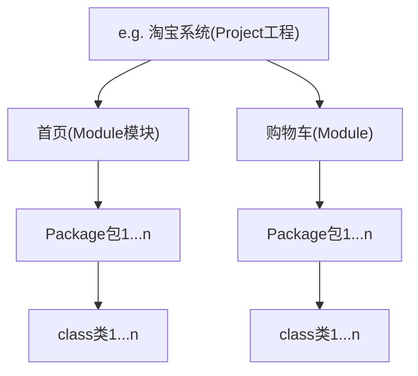

# IDEA安装破解使用

## 安装破解

官网直接装`ideaIU-2024.1.6.exe`，改路径。

[IntelliJ IDEA 2024最新安装激活教程(附激活工具和激活码) - 哔哩哔哩 (bilibili.com)](https://www.bilibili.com/read/cv33606162/)

or[IDEA 2024.2.3 最新破解版安装教程（附激活码，至2099年~） - 犬小哈教程 (quanxiaoha.com)](https://www.quanxiaoha.com/idea-pojie/idea-pojie-202423.html)

IDEA创建Java项目的代码结构：

## 入门使用

1. 创建工程。New Project --> **Empty Project (建议)**

   name（给工程起个名字），Location（工程代码放在哪里）

2. 创建模块。右键工程，New --> Module

   输入模块名即可。如果没有识别到JDK，需要手动添加

3. 创建包。在模块目录下的src右键，New --> Package

   输入包名即可。这里输入`com.itheima.commen`

4. 创建类。在包名右键，New --> Java Class

   输入类名，写代码。

运行后自动编译执行，编译结果在工程目录下的out目录。

## 集成AI插件通义灵码

- Github Copilot
- 阿里巴巴 通义灵码（解释代码、生成单元测试、生成代码注释、生成优化建议、代码片段补全）
- 科大讯飞 星斗AI

步骤：

1. 进入Settings --> Plugins --> 搜索通义灵码，安装。

   然后右侧会出现他的logo，点击可以打开对话框，进行交流。

   需要先登录，在右下角那个logo

2. 使用。

   代码中写一个注释（例如：帮我写一个方法，方法返回一个验证码），回车，他会自动帮你写代码（再回车继续写完）。按Tab就会确定保留代码。

## 常用快捷键

IDEA背景色可换绿色(204,238,200)

| 快捷键                     | 作用                                                       |
| -------------------------- | ---------------------------------------------------------- |
| main/psvm、sout、...       | 快捷键入相关代码                                           |
| Ctrl + D                   | 复制当前行到下一行                                         |
| Ctrl + Y                   | 删除所在行（我改成redo了），建议用Ctrl + X（剪切）实现删除 |
| Ctrl + Alt + L             | 格式化代码                                                 |
| Alt + Shift + ⬆\|⬇         | 上下移动代码                                               |
| Tab \| Shift+Tab           | 左右移动代码                                               |
| Ctrl + /，Ctrl + Shift + / | 注释                                                       |

## 其他操作

修改模块：

- 右键模块 --> Refactor --> Rename

  有三个选项，选第三个，把模块名和文件夹名一起同步修改。

**导入模块**：

- 直接复制过来识别不了。

- 上面导航栏 File --> New --> Module from Exiting Sources

  这时可能有JDK版本问题，右上角会有Setup，点一下（再重启IDEA）就好了。

- 建议直接 File --> Project Structure --> 点击左上角的小加号

删除模块（了解）：

- 右键 --> Remove（这步只是把关联去掉了，文件夹还在）
- 再右键 --> Delete

