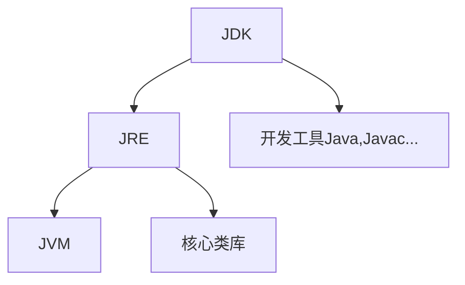
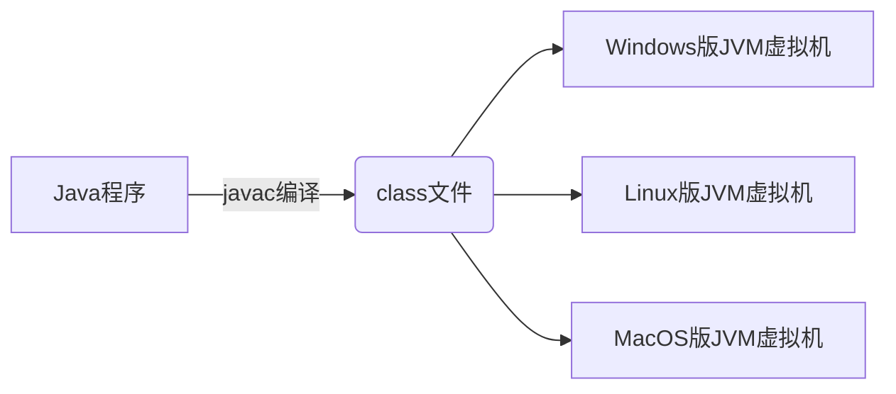

# Java 入门

> [!NOTE] 温馨提示
> 转载请标注来源哦~~
> 
> 本文介绍 Java 语言，你将学习到如何编写运行第一个 Java 程序。文章内容来自站主大学时期的课程笔记。

## Java是什么

是什么？

- 一门高级编程语言

哪家公司开发的，现属哪家公司？

- sun公司

Java之父？

- 詹姆斯·高斯林

可以干嘛？

- 基本上什么都可以干，主要做企业服务端开发

Java的三大技术平台：

- **JavaSE（Java Standard Edition）：标准版**

  java技术的核心和基础，桌面版程序

- **JavaEE（Java Enterprise Edition）：企业版**

  企业级应用开发的一套解决方案

- JavaME（Java Micro Edition）：小型版

  针对移动设备应用的解决方案（手机、电视、相机、微波炉）

## JDK的安装和下载

Java的产品叫**JDK（Java Development Kit：Java开发者工具包）**，必须安装JDK才能使用Java。

去Oracle官网下，这里用[JDK21](https://www.oracle.com/java/technologies/downloads/#jdk21-windows)。或者[Java Platform, Standard Edition 11 Reference Implementations](https://jdk.java.net/java-se-ri/11-MR3)这里下载

已经安装过的如果要卸载：去控制面板卸载程序找到Java直接卸载。

**安装**：

- 直接双击exe，改一下安装路径`D:\Downloads\DevelopEnvs\Java\jdk-21\`，然后下一步安装。(17开始已经不用设置环境变量了)

- 看Java、Javac是否可用

  ```bash
  javac -version # javac 21.0.4
  java -version
  ```

  javac.exe是编译工具、java.exe是执行工具

**JDK的组成**：

- JVM（Java Virtual Machine）：Java虚拟机，真正运行Java程序的地方。
- 核心类库：Java自己写好的程序，给程序员自己的程序调用。
- JRE（Java Runtime Environment）：Java的运行环境。
- JDK



## 环境变量的配置

为了能让Java程序能在任何地方运行，需要配置环境变量。

**Path环境变量**可用于**配置程序的所在路径，以方便在命令行窗口的任意目录下直接通过命令启动该程序**。

有两个（用户变量和系统变量）用户变量只有当前用户可用，系统变量即系统下所有用户都可用。对于个人电脑这两个没区别。

注意事项：

- 目前较新的JDK在安装时，**会自动配置javac、java程序的路径到Path环境变量中**。它帮我配到了这`C:\Program Files\Common Files\Oracle\Java\javapath`。
- （或者）较老版本的JDK要手配，即bin目录`D:\Downloads\DevelopEnvs\Java\jdk-21\bin`。

建议为JDK再配置JAVA_HOME环境变量：【就按这里做这里就行了】

- **JAVA_HOME**：用于告诉操作系统JDK安装在哪里（将来其他技术要通过这个变量找JDK）
- 把jdk-21配给JAVA_HOME（默认没有这个变量，要自己加）即可（`D:\Downloads\DevelopEnvs\Java\jdk-21`）
- 而一旦配置了这个变量，**建议把Path换成：`%JAVA_HOME%\bin`**，以便以后更换JDK版本，只需要更改JAVA_HOME的值即可。

## 开发HelloWorld程序

1）编写。新建HelloWorld.java文件，编写代码：类名必须和文件名一致

```java
public class HelloWorld{
	public static void main(String[] args){
		System.out.println("Hello World!");
	}
}
```

2）编译。cmd进入该文件目录下，输入以下命令进行编译：

```bash
javac HelloWorld.java
```

编译后产出文件HelloWorld.class。

3）运行。然后输入一下命令执行class文件：

```bash
java HelloWorld
```

## Java的跨平台原理

一次编译，处处可用。



