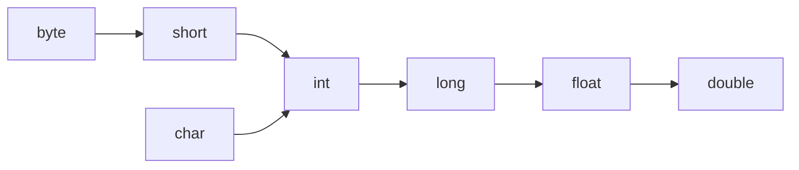
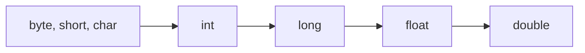

# Java 基本语法--Part 1

> [!NOTE] 温馨提示
> 转载请标注来源哦~~
> 
> 本文介绍 Java 基本语法第一部分，你将学习到 Java 的基本语法。文章内容来自站主大学时期的课程笔记。

**最小功能单元——方法**

## 注释

- 单行注释：//
- 多行注释：/* */
- 文档注释：/** */。一般用在类、方法、成员变量上，且在其上的注释内容会被提取到程序说明文档中。

- （选中代码段），AI生成注释，（再插入回去）

## 字面量

- 整数、小数、字符、字符串、布尔值（true, false）、空值（null）
- 特殊字符字面量（\t, \n, ...)

## 变量

变量是内存中的一块区域，用来放数据。

```
数据类型 变量名 = 值;
```

特点：变量里的数据是可以被替换的。

```
变量名 = 值;
变量名 = 操作; // a = a+1
```

变量存储原理：以二进制存储。

- 字符数据如何存储：ASCII编码，最后以二进制存储
- 图片如何存储：像素点存为二进制

计算机中最小存储单元：字节（Byte，B），一个字节=8bit

二进制、八进制、十六进制：

- 二进制要以0B开头：`int i = 0B001;`
- 八进制要以0开头
- 十六进制要以0x或0X开头

## 数据类型

基本数据类型、引用数据类型（例如字符串，后面程序开发中再学习）

| 数据类型       | 内存占用（字节数） | 数据范围                    | 写法              |
| -------------- | ------------------ | --------------------------- | ----------------- |
| byte           | 1                  | -128~127                    | byte b =10;       |
| short          | 2                  | -32768~32767                | short s = 20;     |
| int（默认）    | 4                  | -2^32^~2^32^-1              | int i = 30;       |
| long           | 8                  |                             | long l = 333333L; |
| float          | 4                  | 1.401298e-45到3.4028235e+38 | float f = 1.1f;   |
| double（默认） | 8                  | 4.9e-324到1.797693e+308     | double d = 1.1;   |
| char           | 2                  | 0~65535                     |                   |
| boolean        | 1                  | true\|false                 |                   |

> 注意：
>
> `long l = 3333333333;`会报错，因为整数默认是int，而它超过了int的表示范围，所以应该加上`l或L`
>
> `float f = 1.1;`也会报错，因为默认是double类型，要加上`f或F`

## 关键字和标识符

关键字：

```
1）48个关键字：
abstract、assert、boolean、break、byte、case、catch、char、class、continue、default、do、double、else、enum、extends、final、finally、float、for、if、implements、import、int、interface、instanceof、long、native、new、package、private、protected、public、return、short、static、strictfp、super、switch、synchronized、this、throw、throws、transient、try、void、volatile、while
    
2）2个保留字（现在没用以后可能用到作为关键字）：
goto、const
    
3）3个特殊直接量：
true、false、null。
```

标识符是程序员自定义的名称，用于给变量、方法、类、包等命名。命名规则如下：

- 由数字、字母、下划线和美元符$组成
- 不能以数字开头
- 变量名：建议首字母小写，驼峰命名
- 类名：建议首字母大写，驼峰命名

## 方法

方法是一种用于执行特定任务或操作的代码块，代表一个功能，可以接收数据进行处理，并返回处理后的返回值。

一般格式：

```
修饰符 返回值类型 方法名(形参列表){
	方法体
	return 返回值;
}
```

在不需要返回值的方法中可以使用`return;`立即结束当前方法的执行。

**方法重载**：

- 一个类中，出现多个方法的名称相同，但是它们的形参列表不同，称为方法重载。

## 自动-强制类型转换

### 自动类型转换

**类型范围小**的变量，可以**直接赋值给类型范围大**的变量。



### 强制类型转换

**类型范围大**的变量，不可以**直接赋值给类型范围小**的变量，需要强制类型转换。

```java
int a = 20;
byte b = (byte) a;
```

但是要注意：

- 类型范围大的变量值本身不可以超过类型范围小的类型取值范围，否则会出现数据溢出（超出的部分被截断了）。
- 浮点数转为整数，会直接截掉小数部分。

### 表达式的自动类型提升

在表达式中，小范围类型的变量，会自动转换成表达式中较大范围的类型，再参与运算。



- 表达式的最终结果类型由表达式中的最高类型决定。

- 再表达式中，byte、short、char是直接转换成int类型参与运算的。

  ```java
  public static int cal(byte a, byte b) {
      return a + b;
  }
  // 或
  public static byte cal(byte a, byte b) {
      return (byte) (a + b);
  }
  ```

## 输入输出

```java
package com.itheima.helloworld;
import java.util.Scanner;

public class HelloWorld {
    public static void main(String[] args) {
        printNameAndAge();
    }

    // 帮我写一个方法，接收用户键盘输入的名字和年龄，并打印。用Scanner工具，不是直接接收形参
    public static void printNameAndAge(){
        Scanner sc = new Scanner(System.in);
        System.out.println("请输入名字：");
        String name = sc.next();
        System.out.println("请输入年龄：");
        int age = sc.nextInt();
        System.out.println("名字：" + name + "，年龄：" + age);
    }
}
```

## 运算符

### 算数运算符

```
+,-,*,/,%
```

+符号与字符串运算是用来连接字符串的：

```java
"abc" + 5 // "abc5"
```

### 自增自减运算符

```java
i++;
i--;
++i;
--i;
```

```java
int a = 10;
int rs = a++; //rs=10
```

```java
int a = 10;
int rs = ++a; //rs=11
```

### 赋值运算符

```
=	+=	-=	*=	/=	%=
```

### 关系运算符

```
>	<	>=	<=	==	!=
```

### 三元运算符

```
条件表达式 ? 值1 : 值2
```

首先计算条件表达式的值，为true则返回值1，否则返回值2

三元运算符可以嵌套：

```java
// 返回三者中最大值
int max = a > b ? (a > c ? a : c) : (b > c ? b : C);
```

### 逻辑运算符

```java
& // 逻辑与
| // 逻辑或
! // 逻辑非 !(2>1)
^ // 逻辑异或 2>1 ^ 3>1
```

```java
&& // 短路与 2>10 && 3>1 结果与上面逻辑与相同，但是过程不同：如果左边为false，右边就不会执行
|| // 短路或。如果左边为true，右边就不会执行
```

## 程序流程控制

- 顺序结构

- 分支结构

  if、switch

- 循环结构

  for、while、do-while

### 分支结构

**if分支**：

```java
if(条件表达式) {
    代码;
} else if(条件表达式) {
    代码;
} ...
else {
    代码;
}
```

如果只有一句代码，可以省略略花括号

**switch分支**：

```java
switch(表达式) {
    case 值1:
        代码;
        break;
    case 值2:
        代码;
        break;
    ...
    default:
        代码;
        [break;]
}
```

switch注意事项：

- 表达式类型只能是byte、short、int、char，JDK5开始支持枚举，JDK7开始支持String。不支持double、float、long（因为Java小数不精确，long又太大了）。
- case给出的值不允许重复；且只能是字面量，不能是变量。
- 正常使用switch的时候，不要忘记写break，否则会出现穿透现象。

穿透现象也有优点：相同程序的case块， 可以通过穿透性进行合并，从而减少重复代码。

```java
// 周二到周五要做的事一样：
String weak = "周六";
switch(weak) {
    case "周一":
        System.out,println("干活");
        break;
    case "周二":
    case "周三":
    case "周四":
    case "周五":
        System.out,println("牛马");
        break;
    case "周六":
    case "周日":
        System.out,println("玩");
        break;
    default:
        System.out,println("???");
}
```

### 循环结构

**for循环**：

```java
for(初始化语句; 循环条件; 迭代语句) {
    需要重复执行的代码;
}
```

**while循环**：

```java
初始化语句;
while(循环条件) {
    需要重复执行的代码;
    迭代语句;
}
```

for能实现的while也能实现，反之亦然。

一般知道循环几次，使用for；不知道循环几次用while。

**do-while循环**：至少执行一次

```java
初始化语句;
do {
    循环体语句;
    迭代语句;
} while(循环条件);
```

**死循环**：

```java
// for
for(;;) {
    循环代码;
}
// while 经典写法
while(true) {
	循环代码;
}
// do-while
do {
    循环代码;
} while(true);
```

**循环的嵌套**：略

### break、continue

- break：跳出并结束当前所在循环的执行（只能在循环和switch分支中使用）
- continue：用于跳出当前循环的当次执行，直接进入循环的下一次执行（只能在循环中使用）

## 数组

### 一维数组

**静态初始化**：

```
数据类型[] 数组名 = {元素1,...元素n};
数据类型[] 数组名 = new 数据类型[]{元素1,...元素n};
```

注意：`数据类型[] 数组名`也可以写成`数据类型 数组名[]`

例如：

```java
String[] names1 = {"zhangsan","lisi","wangwu"};

print(names1.length); // 数组长度
print(names1[0]);
```

**动态初始化**：

```
数据类型[] 数组名 = new 数据类型[长度];
```

动态初始化数组元素默认值规则：

<table>
	<tr>
		<th>数据类型</th>
		<th>明细</th>
		<th>默认值</th>
	</tr>
	<tr>
		<td rowspan="3">基本类型</td>
		<td>byte,short,char,int,long</td>
		<td>0</td>
	</tr>
	<tr>
		<td>float,double</td>
		<td>0.0</td>
	</tr>
    <tr>
		<td>boolean</td>
		<td>false</td>
	</tr>
    <tr>
		<td>引用类型</td>
        <td>类、接口、数组、String</td>
		<td>null</td>
	</tr>
</table>


例如：

```java
double[] scores = new double[8];
scores[0] = 10;
```

### 二维数组

数组的元素又是一个一维数组。

**静态初始化**：

```
数据类型[][] 数组名 = {
	{元素1,...元素n},
	{元素1,...元素n},
	...
};
数据类型[][] 数组名 = new 数据类型[][]{
	{元素1,...元素n},
	{元素1,...元素n},
	...
};
```

**动态初始化**：

```
数据类型[][] 数组名 = new 数据类型[长度1][长度2];
```

**长度**：

```java
int[][] nums = {
    {1,2},
    {1,2,3}
};
print(nums.length); // 2
print(nums[1].length); // 3
```

## 面向对象（核心）

面向对象的三大特征：封装、继承、多态

### 对象

- **对象**就是一种特殊的数据结构。对象是用类new出来的，有了类就可以创建出对象。

- class也就是**类**，也称为对象的设计图（或对象的模板）。

定义类Star.java：

```java
public class Star {
    String name;
    int age;
    double score;
    
    public void printScore(){
        System.out.println(name + "的成绩是：" + score);
    }
}
```

test.java中new实例化对象：

```java
Star s = new Star();
s.name = 'wang'
```

### 构造器

- 没有返回值类型，名字必须和类名一致

- 创建对象（new）时，对象会自动调用构造器。

  创建对象时，可以同时完成对对象成员变量的初始化赋值。

```java
public class Student {
    String name;
    int age;
    // 无参构造器
    public Student() {
        ...
    }
    // 有参构造器
    public Student(String n) {
        name = n;
    }
    public Student(String n, int a) { ... }
}
```

注意事项：

- 类默认自带一个无参构造器。

- 但如果你为类定义了有参构造器，类默认的无参构造器就没有了。

  还想用无参构造器，就必须自己手写一个无参构造器。

### this关键字

- this就是一个变量，可以用在类方法中，来拿到当前对象。
- 应用场景：用来解决变量名称冲突问题（例如构造器的形参一般和成员变量相同）

### 封装

就是用类设计对象处理某个事物的数据时，应该把要处理的数据，以及处理数据的方法，设计到一个对象中去。

封装设计要求：合理隐藏、合理暴露。

- private

  修饰成员变量，只能在本类中被直接访问

- public

  修饰getter和setter方法，公开访问

```java
public class Star {
    private String name;
    private int age;
    private double score;
    
    public void setAge(int age){
        if (age > 0 && age < 200)
            this.age = age;
        else
            System.out.println("age is invalid");
    }
    public int getAge() {
        return this.age;
    }
    ...
}
```

### 实体类

是一种特殊类，满足如下要求：

- 类中的成员变量全部私有，并提供public修饰的getter和setter方法
- 类中需要提供一个无参构造器，有参构造器可选

应用场景：

- 实体类的对象只负责数据存取，而对数据的业务处理交给其他类的对象来完成，以实现**数据和业务处理相分离**。

例如：

```java
/** 业务类 */
public class StudentOperator {
    private Student s;
    
    public StudentOperator(Student s) {
        this.s = s;
    }
    
    // 业务1
    public void printTotalScore() {
        ...
    }
}
```

### static关键字

#### 静态成员变量

成员变量按照有无static修饰，分为两种：

- **静态变量（类变量）**：有static修饰，属于类，在计算机中只有一份，**会被类的全部对象共享**。
- **实例变量（对象的变量）**：无static修饰，属于每个对象的。

**访问方式**：

```
类名.静态变量（推荐）
对象.静态变量（不推荐）
```

```
对象.实例变量
```

**修改方式**：注意下面两种都可以修改静态变量

```
类名.静态变量 = 新值
对象.静态变量 = 新值（不推荐）
```

**静态变量的应用场景**：

- 如果某个数据只需要一份，且希望能够被共享（访问、修改），则该数据可以定义为静态变量。

例如：系统启动后，要求用户类可以记住自己创建了多少个用户对象了。

```java
public class User {
    public static int count = 0;
    
    //构造器
    public User() {
        // User.count++;
        count++; // 同一个类中访问静态变量可以省略类名不写
    }
}
```

#### 静态方法

成员方法的分类：

- **静态方法**：有static修饰的成员方法，属于类。
- **实例方法**：无static修饰的成员方法，属于对象。

**访问方式**：

```
类名.静态方法（推荐）
对象.静态方法（不推荐）
```

```
对象.实例方法
```

规范：

- 如果这个方法只是为了做一个功能且不需要直接访问对象的数据，这个方法可以直接定义为静态方法。
- 如果这个方法是对象的行为，需要访问对象的数据，这个方法必须定义成实例方法。

**静态方法的应用场景**：

- 做工具类。

工具类是什么：

- 工具类中的方法都是一些静态方法，每个方法用来完成一个功能，以便给开发人员直接使用。

工具类好处：

- 提高了代码复用；调用方便，提高了开发效率。
- 每次不用实例化对象，节约内存。

**多学一招**：

- 工具类没有创建对象的需求，建议将工具类的构造器进行私有（private）。

#### 静态/实例方法访问的注意事项

- 静态方法中可以直接访问静态成员（变量/方法），不可以直接访问实例成员（变量/方法）。
- 实例方法中既可以直接访问静态成员（变量/方法），也可以直接访问实例成员（变量/方法）。
- 实例方法中可以出现this关键字，静态方法中不可以出现this关键字（因为this代表的只能是当前**对象**）。

### 继承

#### 认识继承

提高代码的重用性，减少一些重复代码的书写。

Java中提供了一个关键字`extends`，用这个关键字，可以让一个类和另一个类建立起父子关系。

```java
public class B extends A {
    ...
}
```

- 子类能继承父类的非私有成员（变量/方法），父类的私有变量可以通过父类的非私有getter/setter方法访问。
- 子类的对象是由子类、父类共同创建完成的

#### 权限修饰符

权限修饰符就是用来限制类中的成员（成员变量、成员方法、构造器）能够被访问的范围。

- private：只能本类中
- 缺省：本类、同一包中的类
- protected：本类、同一包中的类、子孙类中
- public：任意位置

范围：private < 缺省 < protected < public

#### 继承的特点

- 单继承：Java是单继承模式，一个类只能继承一个直接父类。

- 多层继承：Java不支持多继承，但支持多层继承。

- 祖宗类：Java中所有的类都是Object类的子类。

- 就近原则：有限访问自己类中，自己类中没有的才会访问父类。

  如果子父类中出现了重名的成员，会优先使用子类的，如果此时一定要在子类中使用父类的怎么办：supper关键字

  ```java
  super.父类成员变量/方法
  ```

#### 方法重写

当子类觉得父类中的某个方法不好用，或者无法满足自己的需求时，子类可以重写一个**方法名称、参数列表一样**的方法，去覆盖父类的这个方法，这就是方法重写。

注意：

- 建议在子类重写的**方法上方使用`@Override`注解**，它可以指定Java编译器检查我们方法重写的格式是否正确，代码可读性也会更好。
- 子类重写父类方法时，**访问权限必须必须大于等于**父类方法的权限。
- 重写的方法返回值类型，必须与被重写方法的**返回值类型一样，或者范围更小**。
- 私有方法、静态方法不能被重写，如果重写会报错。

常见场景：

- 子类重写Object类的`toString()`方法，以便返回对象的内容。

  直接打印对象，默认会调用Object类的toString方法（可以省略不写调用toString的代码），返回的是对象的地址信息。所以要重写。

  ```java
  @Override
  public String toString() {
      return ...
  }
  ```

#### 子类构造器的特点

子类的全部构造器，都会先调用父类的构造器，再执行自己的。

- 默认子类全部构造器的第一行代码都是`super();`（可以省略不写），会调用父类的无参构造器。

- 如果父类没有无参构造器/无参构造器私有，必须用`super`指定调用父类的有参构造器：

```java
class Zi extends Fu {
    public Zi() {
        super(6);
        ...
    }
}

class Fu {
    private Fu() { ... }
    public Fu(int a) { ... }
}
```

为什么一定要先调用父类的构造器：

- 子类构造器可以通过调用父类构造器，把对象中包含父类这部分的数据先初始化赋值。
- 再回来把对象里包含子类这部分的数据也进行初始化赋值。

#### 构造器中this调用兄弟构造器

注意：`super`和`this(...)`必须写在构造器第一行，并且两者不能同时出现。

例如：

```java
public class Student {
    private String name;
    private String schoolName;
    
    public Student(String name) {
        // this调用兄弟构造器
        this(name, "清华大学");
    }
    
    public Student(String name, String schoolName) {
        this.name = name;
        this.schoolName = schoolName;
    }
}
```

### 多态

#### 认识多态

多态是在**继承/实现**情况下的**一种现象**，表现为：**对象多态**（人分为男人女人）、**行为多态**（猫喵喵叫，狗汪汪叫）。

#### 多态的好处

- 在多态形势下，对象是解耦合的，更便于扩展和维护。

  这个对象不想用了，可以直接换成另一个（一家公司提供的业务不好，可以无缝换到另一家）:

  ```java
  Animal a = new Dog();
  // 当换成new Cat后，下面的代码（业务）不用动
  a.voice();
  ```

- 定义方法时，使用父类类型的形参，可以接收一切子类对象，扩展性更强、更便利。

  ```java
  public static void main(String[] args) {
      Dog d = new Dog();
      animal_voice(d);
      
      Cat c = new Cat();
      animal_voice(c); // 不给调用
  }
  public static void animal_voice(Dog d) {
      d.voice();
  } // 不便利
  ```

  而下面的就便利：

  ```java
  public static void animal_voice(Animal a) {
      a.voice();
  }
  ```

#### 多态下的问题和类型转换

**多态下的问题**：多态下不能使用子类的独有功能。

```java
public static void main(String[] args) {
    Dog d = new Dog();
    animal_voice(d);

}
public static void animal_voice(Animal a) {
    a.voice();
    a.eat_bone(); // 狗特有方法 吃骨头
}
```

**多态下的类型转换**：

- 自动类型转换：`父类 变量名 = new 子类();`
- 强制类型转换：`子类 变量名 = (子类) 父类变量;`

```java
Animal a = new Dog();
Dog d = (Dog) a; // 强制类型转换
d.eat_bone();
```

强制类型转换的一个注意事项：

- 存在继承/实现关系就可以在编译阶段进行强制类型转换，编译阶段不会报错。
- 运行时，如果发现对象的真实类型于强转后的类型不同，就会报类型转换异常（ClassCastException）错误。

```java
Animal a = new Dog();
Cat c = (Cat) a; // 报错，狗不能转为猫
```

Java 建议强转前，先判断对象的真实类型，再进行强转。改为：

```java
Animal a = new Dog();
if (a.isinstanceof(Cat)) {
    Cat c = (Cat) a;
    ...;
}
else if (a.isinstanceof(Dog)) {
    Dog d = (Dog) a;
    ...;
}
```

