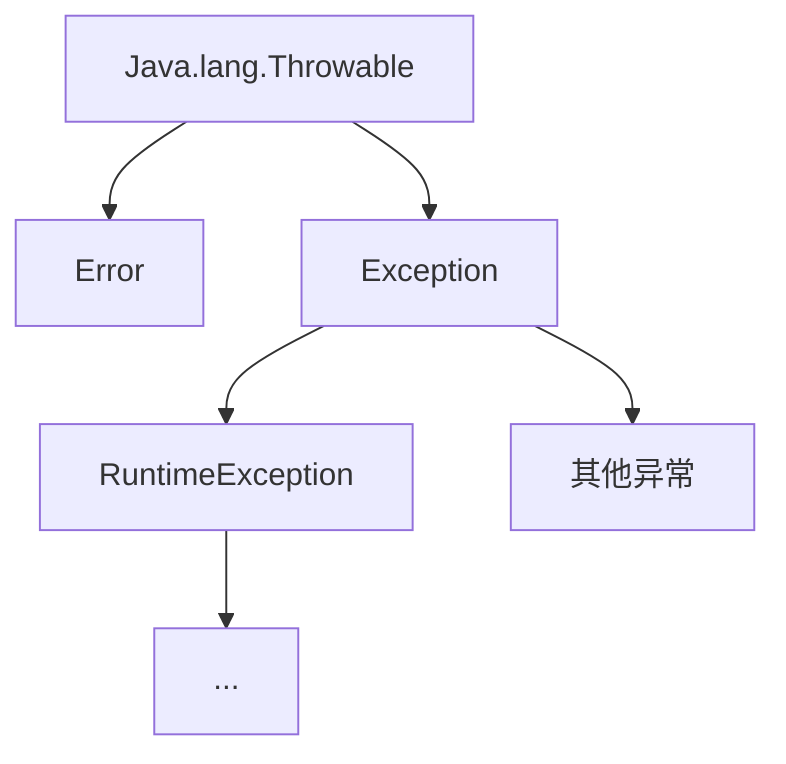

# Java 进阶:异常

> [!NOTE] 温馨提示
> 转载请标注来源哦~~
> 
> 本文介绍 Java 进阶部分，你将学习到 Java 异常的使用以及如何自定义异常。文章内容来自站主大学时期的课程笔记。

## 异常

程序出现的问题

### Java的异常体系



**Error**：代表系统级别错误（属于严重错误），也就是说系统一旦出现问题，sun公司会把这些问题封装成Error对象给出来。（是sun公司自己用的）

**Exception**：异常。代表程序可能出现的问题。

- **运行时异常**：RuntimeException及其子类，编译阶段不会出现错误提醒，运行时才会出现的异常。（代码写错了）
- **编译时异常**：编译阶段就会出现错误提醒的。（担心你会出错，提醒你）

### 异常的基本处理

1. 底层异常层层上抛，最外层捕获异常，记录异常信息，并响应适合用户观看的信息进行提示。
2. 最外层捕获异常后，尝试进行修复（进行处理，不要报错）。

#### 抛出异常

在方法上使用throws关键字，可以将方法内部出现的异常抛出去给调用者处理

```
方法 throws 异常1, 异常2... {

} 
```

#### 捕获异常

```java
try {
    // 可能出现异常的代码
} catch(异常类型1 变量) {
    // 处理异常
} catch(异常类型2 变量) {
    // 处理异常
}...
```

### 异常的作用

1. 用来定位程序bug的关键信息
2. throw异常，可以作为方法内部的一种特殊返回值，以便通知上次调用者，方法的执行问题

```java
public static int divide(int a, int b) {
    if (b == 0) {
        throw new ArithmeticException("除数不能为0");
    }
    return a / b;
}
```

### 自定义异常

**自定义运行时异常**

- 定义一个异常类继承RuntimeException
- 重写构造器
- 通过`throw new 异常类()`来创建异常对象并退出

**自定义编译时异常**

- 定义一个异常类继承Exception
- 重写构造器
- 通过`throw new 异常类()`来创建异常对象并退出

选择：

- 如果你觉得这个错误不太可能会犯，就用运行时异常，提醒不是很强烈
- 此外，sun公司在摒弃编译时异常，太烦了

```java
public class AgeException extends Exception {
    public AgeException(String message) {
        super(message);
    }
}
```

```java
public class Main {
    public static void main(String[] args) {
        try {
            saveAge(130);
        } catch (AgeException e) {
            System.out.println(e.getMessage());
            // e.printStackTrace();
        }
    }

    public static void saveAge(int age) throws AgeException {
        if (age < 1 || age > 120) {
            throw new AgeException("年龄不合法");
        }
        System.out.println("年龄保存成功");
    }
}
```

运行时异常

```java
public class Main {
    public static void main(String[] args) {
        saveAge(130); // 硬要try catch也可以
    }

    public static void saveAge(int age) {
        if (age < 1 || age > 120) {
            throw new AgeException("年龄不合法");
        }
        System.out.println("年龄保存成功");
    }
}

class AgeException extends RuntimeException {
    public AgeException(String message) {
        super(message);
    }
}
```
