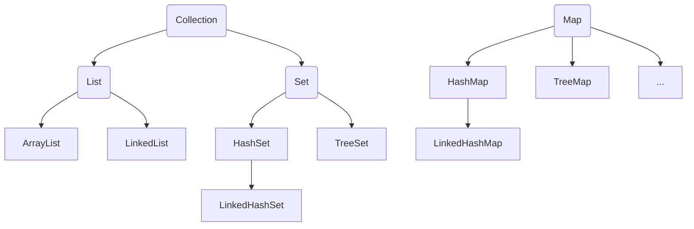

> [!NOTE] 温馨提示
> 转载请标注来源哦~~
> 
> 本文介绍 Java 进阶部分，你将学习到 Java 集合的体系结构和常用集合的使用方法。文章内容来自站主大学时期的课程笔记。

# Java 进阶:集合

## 集合

集合是一种容器，大小可变。

### 集合体系结构



- Collection代表单列集合，每个元素（数据）只包含一个值。
  - List系列集合：添加的元素是**有序**（加入的先后顺序）、可重复、有索引的。
    - ArrayList、LinkedList都是有序、可重复、有索引的
  - Set系列集合：添加的元素是无序（不按加入的先后顺序）、不重复、无索引的。
    - HashSet：无序、不重复、无索引
    - LinkedHashSet：**有序**、不重复、无索引
    - TreeSet：**按照大小默认升序排序**、不重复、无索引

- Map代表双列集合，每个元素包含两个值（键值对）。

### Collection集合

#### 常用方法

| 方法名                              | 说明                             |
| ----------------------------------- | -------------------------------- |
| public boolean add(E e)             | 把给定的对象添加到当前集合中     |
| public void clear()                 | 清空集合                         |
| public boolean remove(E e)          | 从集合中删除指定元素             |
| public boolean contains(Object obj) | 判断当前集合中是否包含给定的对象 |
| public boolean isEmpty()            | 判断当前集合是否为空             |
| public int size()                   | 返回集合中元素的个数             |
| public Object[] toArray()           | 把集合中的元素，转换为数组       |

#### 三种遍历

**(1) 迭代器遍历**

迭代器是用来遍历集合的专用方式（数组没有迭代器，只能遍历集合），在Java中迭代器的代表是Iterator。

- 获取迭代器`Iterator<E> iterator()`：返回集合的迭代器对象，该对象默认指向集合中第一个元素。

迭代器中常用方法：

- `boolean hasNext()`：访问**当前位置**是否有元素存在，存在返回true。
- `E next()`：获取**当前位置**的元素，并同时将迭代器对象指向下一个元素处。

```java
Collection<String> names = new ArrayList<>();
names.add("张三");
...

// 得到集合的迭代器对象
Iterator<String> it = names.iterator();
while (it.hasNext()) {
    String name = it.next();
    System.out.println(name);
}
```

**(2) 增强for（foreach）**

可以用来遍历**集合或数组**。

```
for(元素的数据类型 变量名: 数组或集合) {

}
```

```java
for (String name : names) {
    System.out.println(name);
}
```

**(3) Lambda表达式**

需要使用Collection的方法：

```
default void forEach(Consumer<? super T> action)
```

会将匿名内部类对象传给forEach的action

```java
names.forEach(new Consumer<String>() {
    @Override
    public void accept(String s) {
        System.out.println(s);
    }
});
names.forEach(s -> System.out.println(s)); // 简化
names.forEach(System.out::println); // 简化
```

#### 集中遍历的区别--并发修改异常问题

遍历集合的同时又存在增删改查集合元素的行为时可能会出现业务异常，这种现象称之为**并发修改异常问题**。

需求：购物车存在如下商品：Java入门、宁夏枸杞、枸杞子、黑枸杞、特技枸杞。现在用户不想买枸杞，选择了批量删除。

##### 1 for循环

```java
ArrayList<String> list = new ArrayList<>();
list.add("Java入门");
list.add("宁夏枸杞");
list.add("枸杞子");
list.add("黑枸杞");
list.add("特技枸杞");
// 错误
for (int i = 0; i < list.size(); i++) {
    String name = list.get(i);
    if (name.contains("枸杞子")) {
        list.remove(name);
    }
}
System.out.println(list);
```

输出：`[Java入门, 枸杞子, 特技枸杞]`

原因是删除后，i索引指向被删元素下一个，导致该元素未被删除。

解决方法1：`i--;`

```java
for (int i = 0; i < list.size(); i++) {
    String name = list.get(i);
    if (name.contains("枸杞子")) {
        list.remove(name);
        i--;
    }
}
```

解决方法2：倒着删除（前提是支持索引）

```java
for (int i = list.size() - 1; i >= 0; i--) {
    String item = list.get(i);
    if (item.contains("枸杞")) {
        list.remove(i);
    }
}
```

##### 2 迭代器

也存在并发修改异常的问题，下面的代码会直接报错。原因是`next()`方法会检查集合是否被修改，如果遍历时被修改会报错。

```java
// 错误
Iterator<String> iterator = list.iterator();
while (iterator.hasNext()) {
    String item = iterator.next();
    if (item.contains("枸杞")) {
        list.remove(item);
    }
}
```

解决方法：**用迭代器的方法`iterator.remove();`删除**

```java
Iterator<String> iterator = list.iterator();
while (iterator.hasNext()) {
    String item = iterator.next();
    if (item.contains("枸杞")) {
        iterator.remove();
    }
}
```

##### 3 增强for和Lambda（forEach）

**都不行**。增强for底层是用迭代器，但是拿不到迭代器，无法修正。

```
for (String s : list) {
    if (s.contains("枸杞")) {
        list.remove(s);
    }
}
```

```
list.forEach(s -> {
    if (s.contains("枸杞")) {
        list.remove(s);
    }
});
```

##### 总结：想要一边遍历一边删除

- 如果集合没有索引，只能用迭代器的删除方法。

- 如果集合有索引，则可以使用for循环和迭代器删除。

- 增强for和Lambda只适合做遍历，不适合做增删操作。

或者使用：

```java
list.removeIf(s -> s.contains("枸杞"));
```

### Collection-List集合

#### 特点、功能

有序、可重复、有索引

List支持索引，所以多了很多与索引相关的方法。当然，Collection的功能List也都继承了。

| 方法名称                       | 说明                                 |
| ------------------------------ | ------------------------------------ |
| void add(int index, E element) | 在此集合中的指定位置插入指定的元素   |
| E remove(int index)            | 删除指定索引处的元素，返回被删元素   |
| E set(int index, E element)    | 修改指定索引处的元素，返回被修改元素 |
| E get(int index)               | 返回指定索引处的元素                 |

**支持的遍历方式**：

1. for循环（因为有索引）
2. 迭代器
3. 增强for循环
4. Lambda表达式（forEach）

#### ArrayList和LinkedList的不同

底层采用的数据结构不同。

- ArrayList是基于**数组**存储数据的

  - （根据索引）查询速度快。
  - 增删数据效率低（容量不够会扩容、删除后面的数据要前移）。

- LinkedList是基于**双链表**存储数据的

  链表结点在内存中不连续，每个结点包含数据值和下一个结点地址。

  - 查询慢（无论查询哪个数据都要从头开始遍历）。
  - 增删相对快。

  双链表：首尾指针

  - 查询慢

  - 对首尾元素进行增删改查的速度极快。

  | 方法名称                  | 说明                         |
  | ------------------------- | ---------------------------- |
  | public void addFirst(E e) | 在列表头部插入指定元素       |
  | public void addLast(E e)  | 在列表尾部插入指定元素       |
  | public E getFirst()       | 返回列表第一个元素           |
  | public E getLast()        | 返回列表最后一个元素         |
  | public E removeFirst()    | 从列表删除并返回第一个元素   |
  | public E removeLast()     | 从列表删除并返回最后一个元素 |

  应用场景：

  - 设计队列（先进先出，首部出队、尾部进队）。
  - 设计栈（先进后出，栈顶出栈）。

### Collection-Set集合

#### 特点

无序（添加元素的顺序和获取出的顺序不一致）、不重复、无索引

- HashSet：无序、不重复、无索引
- LinkedHashSet：有序（添加的顺序和实际顺序一致）、不重复、无索引
- TreeSet：排序（自动升序）、不重复、无索引

基本都是Collection的功能，几乎没有额外的新功能。

#### HashSet底层原理

哈希值

- 就是一个**int类型的随机值，Java中每个对象都有一个哈希值。**
- Java中所有对象，都可以用Object类的`hashCode()`方法返回对象的哈希值。
- 同一个对象多次调用`hashCode()`返回的哈希值相同。
- 不同的对象，它们的哈希值大概率不同，也有可能相同（哈希碰撞）。

HashSet基于**哈希表**存储数据。

- JDK8之前，哈希表=数组+链表。
  1. 创建一个默认长度为16的数组，默认加载因子为0.75，数组名table
     - 当数组存入16*0.75=12时，扩容两倍（32），重新存入数据。
  2. 使用元素的哈希值对数组的长度做取余运算计算出存入的位置。
  3. 判断当前位置是否为null，如果是null直接存入。否则，调用equals方法比较是否相等；如果相等则不存，不相等则存入。
     - JDK8之前，新元素存入数组，占老元素位置，老元素挂下面（头插入）
     - JDK8开始，新元素挂老元素下面（尾插入）
- JDK8开始，哈希表=数组+链表+红黑树（可以自平衡的二叉树）。
  - 当链表长度超过8，且数组长度>=64时，自动将链表转成红黑树。

哈希表是一种增删改查性能都较好的数据结构。

#### 自定义对象去重

需求：创建一个存储对象的集合，存储多个对象。要求多个学生对象的成员变量相同时，我们就认为是同一个对象，只保留一个。

```
Set<Student> set = new HashSet<>();
set.add(new Student("小明", 18, "北京"));
set.add(new Student("小红", 18, "南京"));
set.add(new Student("小明", 18, "北京"));
set.add(new Student("小红", 18, "南京"));
System.out.println(set);
```

如果希望Set集合认为2个内容一样的对象时重复的，必须**重写对象的hashCode方法和equals方法**：

```java
@Override
public boolean equals(Object o) {
    if (this == o) return true;
    if (o == null || getClass() != o.getClass()) return false;
    Student student = (Student) o;
    return age == student.age && Objects.equals(name, student.name) && Objects.equals(address, student.address);
}

@Override
public int hashCode() {
    return Objects.hash(name, age, address);
}
```

#### LinkedHashSet底层原理

**有序**、不重复、无索引。

- 依然是基于哈希表（数组+链表+红黑树）实现的。
- 但是，它的每个元素额外的多了一个双链表机制记录它前后元素的位置（读的时候，从首支指针开始寻找）。
- 更浪费内存了。

#### TreeSet

**可排序（默认升序）**、不重复、无索引。

- 底层基于红黑树实现的排序。
  - 对于数值类型：Integer、Double，默认按数值大小升序
  - 对于字符串类型：默认按首字符的编号升序
  - 对于自定义类型（如Student对象），默认无法排序

**解决方法**：

1. 让对象类实现Comparable接口，重写compareTo方法。

   ```java
   @Override
   public int compareTo(Student o) {
       if (this.age > o.age) return 1;
       else if (this.age < o.age) return -1;
       else return 0; // 如果想根据年龄去重返回0，否则返回非0
   }
   ```

   ```java
   @Override
   public int compareTo(Student o) {
       return this.age - o.age;
   }
   ```

2. 集合自带比较器Comparator对象，指定比较规则。

   ```java
   Set<Student> set = new TreeSet<>(new Comparator<Student>() {
       @Override
       public int compare(Student o1, Student o2) {
           return o1.getAge() - o2.getAge();
       }
   });
   ```

   ```java
   Set<Student> set = new TreeSet<>(((o1, o2) -> o1.getAge() - o2.getAge()));
   ```

如果要比较Double类型，就不能这么写了，要老实点判断。

或者调用Double的方法：

```java
Set<Student> set = new TreeSet<>(((o1, o2) -> Double.compare(o1.getSalary(), o2.getSalary())));
```

### Map集合

#### 体系和特点

- Map集合也叫“键值对集合”
- 所有键不允许重复，值可以重复。键和值一一对应。

应用场景：

需要存储一一对应的数据对时。例如购物车：

```
{商品1: 2, 商品2: 3, ...}
```

Map集合的特点都是**由键决定**的。

- HashMap：无序、不重复、无索引。（键值对都可以是null）
- LinkedHashMap：有序、不重复、无索引。（键值对都可以是null）
- TreeMap：按照key大小默认升序排序、不重复、无索引。（**键不可以是null**）

#### 常用方法

Map集合的方法：

| 方法名称                                   | 说明                |
| ------------------------------------------ | ------------------- |
| public V put(K key, V value)               | 添加元素            |
| public int size()                          | 获取集合的大小      |
| public void clear()                        | 清空集合            |
| public boolean isEmpty()                   | 判断结合是否为空    |
| public V get(Object key)                   | 根据键获取值        |
| public V remove(Object key)                | 根据键删除元素      |
| public boolean containsKey(Object key)     | 判断是否包含某个键  |
| public boolean containsValue(Object value) | 判断是否包含某个值  |
| public Set\<K\> keySet()                   | 获取全部键的集合    |
| public Collection\<V\> values()            | 获取Map集合的全部值 |

#### 遍历方式

(1) 键找值——先获取Map集合全部的键，再通过遍历键来找值。

```java
Set<String> keySet = map.keySet();
for (String key : keySet) {
    String value = map.get(key);
    System.out.println(key + ":" + value);
}
```

(2) 键值对——把“键值对”看成一个整体进行遍历。（难度较大）

- 想办法把Map集合变成Set集合来遍历
- `entrySet()`方法会遍历把Map中的每个键值对封装为Entry对象

```java
for (Map.Entry<String, String> entry : map.entrySet()) {
    System.out.println(entry.getKey() + ":" + entry.getValue());
}
```

(3) Lambda——JDK1.8开始的新技术。内部用的是法二（非常简单）

```java
map.forEach(new BiConsumer<String, String>() {
    @Override
    public void accept(String key, String value) {
        System.out.println(key + ":" + value);
    }
});
// or
map.forEach((k, v) -> System.out.println(k + ":" + v));
```

#### 实现原理

和Set一样，Set底层就是用Map实现的。

