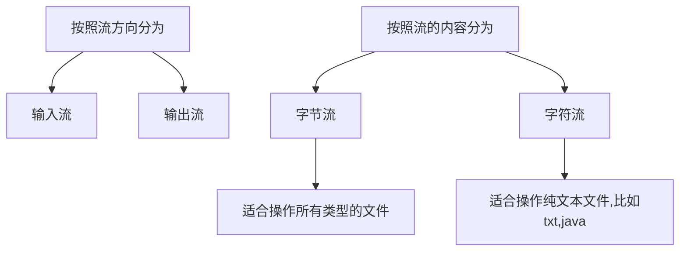

> [!NOTE] 温馨提示
> 转载请标注来源哦~~
> 
> 本文介绍 Java 进阶部分，你将学习到 Java 的 File 和 IO 流的使用方法。文章内容来自站主大学时期的课程笔记。

# Java 进阶<File & IO流>

## File & IO流

**File**是java.io.包下的类，File类的对象，用于代表当前操作系统的文件（可以是文件、文件夹）。

File类只能**对文件本身进行操作**，不能读写文件里面存储的数据。

**IO流**：用于**读写数据**（可以读写文件，或网络中的数据）

### File

创建File类的对象：

| 构造器                                   | 说明                                       |
| ---------------------------------------- | ------------------------------------------ |
| **public File(String pathname)**         | 根据文件路径创建文件对象                   |
| public File(String parent, String child) | 根据父路径和子路径创建文件对象             |
| public File(File parent, String child)   | 根据父路径对应文件对象和子路径创建文件对象 |

注意：

- File代表的可以是文件、文件夹。
- File封装的对象仅仅是一个路径名，这个路径可以是存在的，也可以是不存在的。

**File判断文件类型、获取文件信息功能**：

| 方法名称                        | 说明                                                     |
| ------------------------------- | -------------------------------------------------------- |
| public boolean exits()          | 判断当前文件对象，对应的文件路径是否存在，存在则返回true |
| public boolean isFile()         | 判断当前文件对象指代的是否是文件，是文件则返回true       |
| public boolean isDirectory()    | 判断当前文件对象指代的是否是文件夹，是文件夹则返回true   |
| public String getName()         | 获取文件名称（包含后缀）                                 |
| public long length()            | 获取文件的大小，返回字节个数                             |
| public long lastModified()      | 获取文件的最后修改时间                                   |
| public String getPath()         | 获取创建文件对象时，使用的路径                           |
| public String getAbsolutePath() | 获取绝对路径                                             |

- 相对路径：从当前工程目录下开始。

File提供的**创建**的方法：

| 方法名                         | 说明                   |
| ------------------------------ | ---------------------- |
| public boolean createNewFile() | 创建以恶搞新的空的文件 |
| public boolean mkdir()         | 创建一级文件夹         |
| public boolean mkdirs()        | 创建多级文件夹         |

File类**删除**文件的功能：

| 方法名                  | 说明               |
| ----------------------- | ------------------ |
| public boolean delete() | 删除文件、空文件夹 |

- 注意：delete方法默认只能**删除文件和空文件夹**，删除后的文件**不会进入回收站**。

File提供的**遍历文件夹**的功能：

| 方法名                    | 说明                                                         |
| ------------------------- | ------------------------------------------------------------ |
| public String[] list()    | 获取当前目录下**所有的一级文件名称**到一个字符串数组中返回   |
| public File[] listFiles() | 获取当前目录下**所有的一级文件对象**到一个文件对象数组中返回（重点） |

使用listFiles方法的注意事项：

- 当主调是文件，或者路径不存在时，返回null
- 当主调是空文件夹，返回一个长度为0的数组对象
- 当主调是一个有内容的文件夹时，将**里面所有一级文件和文件夹的路径放在File数组中返回**
- 当主调是一个文件夹，且里面有隐藏文件时，将里面所有一级文件和文件夹的路径放在File数组中返回，**包含隐藏文件**
- 当主调是一个文件夹，但是没有权限访问该文件夹时，返回null

示例：

```java
public static void main(String[] args) throws IOException {

    File file = new File("D:/MyTemp/img/wallpicture.jpg");
    boolean newFile = file.createNewFile();
	System.out.println(file.length());
    System.out.println(file.getAbsolutePath());

    // 创建一级文件夹
    File dir1 = new File("D:/MyTemp/img/");
    boolean mkdir = dir1.mkdir();

    // 创建二级文件夹
    File dir2 = new File("D:/MyTemp/img/wallpaper/");
    boolean mkdirs = dir2.mkdirs();
    
    // 删除文件
    boolean delete = file.delete();
    boolean delete1 = dir1.delete(); // 空的才行
}

```

### 方法递归

方法调用自身的形式称为方法递归（recursion）。

- 直接递归：方法自己调用自己。
- 间接递归：方法调用其他方法，其他方法又回调方法自己。

**递归三要素**：

1. 递归的公式
2. 递归的终结点
3. 递归的方向必须走向终结点

#### 猴子吃桃

猴子第一天摘下若干桃子，当即吃了一半，觉得好不过瘾，于是又多吃了一个
第二天又吃了前天剩余桃子数量的一半，觉得好不过瘾，于是又多吃了一个
以后每天都是吃前天剩余桃子数量的一半，觉得好不过瘾，又多吃了一个
等到第10天的时候发现桃子只有1个了。

需求：请问猴子第一天摘了多少个桃子？

分析：整体来看，每一天都是做同一个事件，典型的规律化问题，考虑递归三要素

1. 递归的公式：f(n) = f(n-1) - (f(n-1)/2 + 1) = f(n-1)/2 - 1 ====> f(n) = 2f(n+1) + 2
2. 递归的终结点：f(10) = 1
3. 递归的方向必须走向终结点（要换成f(n) = 2f(n+1) + 2）

```java
public static int f(int n) {
    if (n==10) return 1;
    return 2*f(n+1) + 2;
}
```

#### 文件搜索

没有公式

需求：从D盘中，搜索QQ.exe这个文件，找到后直接输出其位置。

分析：

1. 先找出D盘下所有一级文件对象
2. 遍历全部一级文件对象，判断是否是文件
   1. 如果是文件，判断是否是想要的
   2. 如果是文件夹，继续进入到该文件夹，重复上述过程

```java
public static String searchFile(File dir, String targetFileName) {
    File[] files = dir.listFiles();
    if (files != null) {
        for (File file : files) {
            if (file.isDirectory()) {
                String result = searchFile(file, targetFileName);
                if (result != null) {
                    return result;
                }
            } else {
                if (file.getName().equals(targetFileName)) {
                    return file.getAbsolutePath();
                }
            }
        }
    }
    return null;
}
```

### 字符集

#### 分类

标准ASCII字符集：

- 包括英文、符号。
- 使用**1字节**存储**一个字符**，首位是0，因此，总共可以表示128位字符。

GBK（汉字内码扩展规范，国标）：

- 包含2万多个汉字等字符，GBK中一个**中文字符**编码成**两个字节**的形式存储。
- GBK兼容了ASCII字符集（汉字二进制第一位必须是1，用于区分中英文）。

Unicode字符集（统一码，也叫万国码）：

- 是国际组织指定的，可以容纳世界上所有文字、符号的字符集。
- UTF-32：4个字节表示一个字符，太奢侈，可容纳43亿个字符
- **UTF-8**：最通用
  - 可变长编码方案（用前缀码区分不同字节的字符），共分四个长度区：1字节、2字节、3字节、4字节
  - 英文字符、数字等只占1个字节（兼容标准ASCII编码），汉字占3个字节

注意：

- 字符编码时使用的字符集，和解码时用的字符集必须一致，否则会出现乱码
- 英文/数字一般不会乱码，因为很多字符集都兼容ASCII编码

#### 对字符进行编码解码

对字符的编码

| String提供了方法                    | 说明                                                         |
| ----------------------------------- | ------------------------------------------------------------ |
| byte[] getBytes()                   | 使用平台的**默认字符集**将该String编码位一系列字节，将结果存储到新的字节数组中 |
| byte[] getBytes(String charsetName) | 使用**指定的字符集**将该String编码位一系列字节，将结果存储到新的字节数组中 |

对字符的解码

| String提供了方法                         | 说明                                                       |
| ---------------------------------------- | ---------------------------------------------------------- |
| String(byte[] bytes)                     | 使用平台的**默认字符集**解码指定的字节数组来构造新的String |
| String(byte[] bytes, String charsetName) | 使用**指定的字符集**解码指定的字节数组来构造新的String     |

### IO流

I指Input，输入流：负责把数据读到内存中去。

O指Output，输出流：负责把数据读出去。



因此又分为：（都是抽象类）

- 字节输入流 InputStream
- 字节输出流 OutputStream
- 字符输入流 Reader
- 字符输出流 Writer

### 字节流

#### FileInputStream

文件字节输入流：以内存为基准，可以把磁盘文件中的数据以字节的形式读入到内存中。

| 构造器                                  | 说明                           |
| --------------------------------------- | ------------------------------ |
| public FileInputStream(File file)       | 创建字节输入流管道与源文件接通 |
| public FileInputStream(String pathname) | 简化写法，同上                 |

| 方法名称                               | 说明                                                         |
| -------------------------------------- | ------------------------------------------------------------ |
| public int read()                      | 每次读取一个字节返回，如果没有数据可读会返回-1               |
| public int read(byte[] buffer)         | 每次用一个字节数组去读取数据，返回字节数组读取了多少个字节，如果没有数据可读会返回-1 |
| public void close() throws IOException | 关闭流                                                       |

字节流读取文本有问题：可能会截断汉字的字节，导致乱码。

一次性读完全部字节：但是如果文件过大，会内存溢出。

| 方法名称                                        | 说明                                                         |
| ----------------------------------------------- | ------------------------------------------------------------ |
| public byte[] readAllBytes() throws IOException | 直接将当前字节输入流对应的文件对象的字节数据装到一个字节数组返回 |

**读取文本适合用字符流；字节流适合做数据的转移**，比如：文件复制。

#### FileOutputStream

文件字节输出流：以内存位基准，把内存中的数据以字节的形式写出到文件中去。

| 构造器                                                   | 说明                                                 |
| -------------------------------------------------------- | ---------------------------------------------------- |
| public FileOutputStream(File file)                       | 创建字节输出流管道与源文件对象接通，默认会先清空文件 |
| public FileOutputStream(String filepath)                 | 同上（常用），如果没有，会自动创建该文件             |
| public FileOutputStream(File file, boolean append)       | 创建字节输出流管道与源文件对象接通，可追加数据       |
| public FileOutputStream(String filepath, boolean append) | 同上（常用）                                         |

| 方法名称                                           | 说明                       |
| -------------------------------------------------- | -------------------------- |
| public void write(int a)                           | 写一个字节（ASCII码）出去  |
| public void write(byte[] buffer)                   | 写一个字节数组出去         |
| public void write(byte[] buffer, int pos, int len) | 写一个字节数组的一部分出去 |
| public void close() throws IOException             | 关闭流                     |

示例：

```java
FileOutputStream fileOutputStream = new FileOutputStream("test.txt");
fileOutputStream.write("hello world".getBytes());
fileOutputStream.close();
```

#### 文件复制

任何文件的底层都是字节，字节流做复制，是一字不漏的转移完全部字节，只要复制后的文件格式一致就没问题。

```java
public static void main(String[] args) throws Exception {
    // 使用字节流完成文件的复制
    FileInputStream fis = new FileInputStream("D:\\MyTemp\\img\\wallpicture.jpg");
    FileOutputStream fos = new FileOutputStream("\"D:\\MyTemp\\img\\wallpicture2.jpg");
    byte[] bytes = new byte[1024];
    int len;
    while ((len = fis.read(bytes)) != -1) {
        fos.write(bytes, 0, len); // 使用len，读取多少就写入多少，防止读取到上次残留的数据
    }
    fos.close();
    fis.close();
}
```

#### 资源释放问题

##### try-catch-finally

作用：一般用于在程序执行完后进行资源的释放操作（专业级做法）。

```java
public static void main(String[] args) {
    FileInputStream fis = null;
    FileOutputStream fos = null;
    try {
        fis = new FileInputStream("D:\\MyTemp\\img\\wallpicture.jpg");
        fos = new FileOutputStream("D:\\MyTemp\\img\\wallpicture2.jpg");
        byte[] bytes = new byte[1024];
        int len;
        while ((len = fis.read(bytes)) != -1) {
            fos.write(bytes, 0, len);
        }
    } catch (IOException e) {
        e.printStackTrace();
    } finally {
        if (fos != null) {
            try {
                fos.close();
            } catch (IOException e) {
                throw new RuntimeException(e);
            }
        }
        if (fis != null) {
            try {
                fis.close();
            } catch (IOException e) {
                throw new RuntimeException(e);
            }
        }
    }
}
```

##### try-with-resource（推荐）

上面的做法太臃肿，JDK7开始提供了更简单的做法：

```
try (定义资源1; 定义资源2; ...) {
	可能出现异常的代码
} catch (异常类型 异常名) {
	异常处理代码
}
```

资源使用完毕后，会自动调用其close方法，完成对资源的释放。

注意：

- ()中只能放资源，否则会报错。
- 资源：是指最终实现了AutoCloseable接口（Closeable继承自AutoCloseable）。

示例：

```java
public static void main(String[] args) {
    try (FileInputStream fis = new FileInputStream("xx\\x.jpg");
         FileOutputStream fos = new FileOutputStream("xx\\x2.jpg");
        ) {

        byte[] bytes = new byte[1024];
        int len;
        while ((len = fis.read(bytes)) != -1) {
            fos.write(bytes, 0, len);
        }
    } catch (IOException e) {
        e.printStackTrace();
    }
}
```

### 字符流

#### FileReader

文件字符输入流：以内存为基准，把文件中的数据以**字符**的形式读入到内存中去。

| 构造器                             | 说明                           |
| ---------------------------------- | ------------------------------ |
| public FileReader(File file)       | 创建字符输入流管道与源文件接通 |
| public FileReader(String pathname) | 同上（常用）                   |

| 方法名称                       | 说明                                                         |
| ------------------------------ | ------------------------------------------------------------ |
| public int read()              | 每次读取一个字符返回，如果发现没有数据可读会返回-1           |
| public int read(char[] buffer) | 每次用一个字符数组读取数据，返回字符数组读取了多少字符，如果没有数据可读会返回-1 |

示例：

```java
public static void main(String[] args) {
    try (Reader reader = new FileReader("D:\\MyTemp\\java.txt");) {
        char[] chars = new char[3];
        int len;
        while ((len = reader.read(chars)) != -1) {
            System.out.print(new String(chars, 0, len)); // 自动换行
        }
    } catch (IOException e) {
        e.printStackTrace();
    }
}
```

#### FileWriter

文件字符输出流：以内存为基准，把内存中的数据以**字符**的形式写出到文件中去。

| 构造器                                             | 说明                                             |
| -------------------------------------------------- | ------------------------------------------------ |
| public FileWriter(File file)                       | 创建字符输出流管道与源文件对象接通，会先清空文件 |
| public FileWriter(String pathname)                 | 同上（常用）                                     |
| public FileWriter(File file, boolean append)       | 创建字符输出流管道与源文件对象接通，可追加数据   |
| public FileWriter(String pathname, boolean append) | 同上（常用）                                     |

| 方法名称                                  | 说明                     |
| ----------------------------------------- | ------------------------ |
| void write(int c)                         | 写一个字符               |
| void write(String str)                    | 写一个字符串             |
| void write(String str, int off, int len)  | 写一个字符串的一部分     |
| void write(char[] cbuf)                   | 写一个字符数组           |
| void write(char[] cbuf, int off, int len) | 写入一个字符数字的一部分 |

示例：

```java
try (Writer writer = new FileWriter("D:\\MyTemp\\test.txt")) {
    writer.write('2');
    writer.write('王');
    writer.write("hello world");
} catch (IOException e) {
    e.printStackTrace();
}
```

##### 注意事项

字符输出流写出数据后，必须刷新流，或者关闭流，写出去的数据才会生效。

因为是先写到内存缓冲区中，

| 方法名称                               | 说明                                                         |
| -------------------------------------- | ------------------------------------------------------------ |
| public void flush() throws IOException | 刷新流，就是将内存中缓存的数据立即写到文件中去（刷新后流可以继续使用） |
| public void close() throws IOException | 关闭流，包含了刷新流                                         |

### 缓冲流

缓冲字节输入/输出流：BufferedInputStream，BufferedOuputStream

缓冲字符输入/输出流：BufferedReader，BufferedWriter

#### 缓冲字节流

为了提高字节（输入/出）流的性能。

原理：缓冲字节流自带了8KB的缓冲池。

| 构造器                                      | 说明                                                         |
| ------------------------------------------- | ------------------------------------------------------------ |
| public BufferedInputStream(InputStream is)  | 把低级的字节输入流包装成一个高级的缓冲字节输入流，从而提高读取数据的性能 |
| public BufferedInputStream(OutputStream os) | 把低级的字节输出流包装成一个高级的缓冲字节输出流，从而提高写入数据的性能 |

示例：

```java
// 缓冲字节流实现文件复制，用try-with-resource
try (
        InputStream in = new FileInputStream("D:\\test.txt");
        BufferedInputStream bis = new BufferedInputStream(in);
        OutputStream out = new FileOutputStream("D:\\test2.txt");
        BufferedOutputStream bos = new BufferedOutputStream(out);
) {
    byte[] buffer = new byte[1024];
    int len;
    while ((len = bis.read(buffer)) != -1) {
        bos.write(buffer, 0, len);
    }
} catch (IOException e) {
    e.printStackTrace();
}
```

#### 缓冲字符流

原理：自带了8KB的缓冲池。

| 构造器                          | 说明                                                         |
| ------------------------------- | ------------------------------------------------------------ |
| public BufferedReader(Reader r) | 把低级的字符输入流包装成一个高级的缓冲字符输入流，从而提高读取数据的性能 |
| public BufferedWriter(Writer w) | 把低级的字符输出流包装成一个高级的缓冲字符输出流，从而提高写入数据的性能 |

缓冲字符输入、输出流新增功能：按行读取字符、换行

| 方法                     | 说明                                           |
| ------------------------ | ---------------------------------------------- |
| public String readLine() | 读取一行数据返回，如果没有数据可读了，返回null |
| public void newLine()    | 换行                                           |

示例：

```java
// 缓冲字符输入流
try (BufferedReader br = new BufferedReader(new FileReader("test.txt"))) {
    String line;
    while ((line = br.readLine()) != null) {
        System.out.println(line);
    }
} catch (IOException e) {
    e.printStackTrace();
}
// 缓冲字符输出流
try (BufferedWriter bw = new BufferedWriter(new FileWriter("test.txt"))) {
    bw.write("hello world");
    bw.newLine();
} catch (IOException e) {
    e.printStackTrace();
}
```

### 其他流

#### 字符输入转换流InputStreamReader

属于字符输入流。

- 解决不同编码时，字符流读取文件内容乱码问题。

- 解决思路：先获取文件的原始字节流，再将其按真实的字符集编码转成字符输入流（你需要的编码方式），这样就不会乱码了。

| 构造器                                                       | 说明                                                         |
| ------------------------------------------------------------ | ------------------------------------------------------------ |
| public InputStreamReader(InputStream is)                     | 把原始的字节输入流，按代码默认的编码转成字符输入流（与直接用FileReader的效果一样） |
| **public InputStreamReader(InputStream is, String charset)** | 把原始的字节输入流，按指定字符集编码成字符输入流（重点）     |

示例：

```java
try (
        InputStream is = new FileInputStream("D:\\test.txt");
        InputStreamReader isr = new InputStreamReader(is, "GBK");
        BufferedReader br = new BufferedReader(isr);
        ) {
    String line;
    while ((line = br.readLine()) != null) {
        System.out.println(line);
    }
} catch (IOException e) {
    e.printStackTrace();
}
```

#### 打印流

- PrintStream：属于字节输出流

- PrintWriter：属于字符输出流

作用：打印流可以实现更方便、高效的打印数据出去，能实现打印啥出去就是啥出去（不会说打印97输出a）。

| 构造器                                                       | 说明                                     |
| ------------------------------------------------------------ | ---------------------------------------- |
| public **PrintStream**(OutputStream/File/**String**)         | 打印流直接通向字节输出流/文件/文件路径   |
| public PrintStream(String filename, Charset charset)         | 可以指定写出去的字符编码                 |
| public PrintStream(OutputStream out, boolean autoFlush)      | 可以指定实现自动刷新                     |
| public PrintStream(OutputStream out, boolean autoFlush, String encoding) | 可以指定实现自动刷新，并可指定字符的编码 |

| 方法                                       | 说明                           |
| ------------------------------------------ | ------------------------------ |
| public void **print(Xxx xx)**              | 打印任意类型的数据出去，不换行 |
| public void **println(Xxx xx)**            | 打印任意类型的数据出去，并换行 |
| public void write(int/byte[]/byte[]一部分) | 可以支持写**字节**数据出去     |

示例：

```java
try (
        // PrintStream ps = new PrintStream("D:\\MyTemp\\test.txt")
        // PrintWriter ps = new PrintWriter("D:\\MyTemp\\test.txt")
        // 追加
        PrintWriter ps = new PrintWriter(new FileWriter("D:\\MyTemp\\test.txt", true))
) {
    ps.println("hello world");
    ps.println(97);
    ps.println(true);

} catch (Exception e) {
    e.printStackTrace();
}
```

#### 特殊数据流	

- DataInputStream：特殊数据输入流，属于字节输入流
  - 允许把**数据和其类型**一并写出去
- DataOutputStream：特殊数据输出流，属于字节输出流

| 构造器                                    | 说明                                 |
| ----------------------------------------- | ------------------------------------ |
| public DataOutputStream(OutputStream out) | 创建新数据输出流包装基础的字节输出流 |

| 方法                                                         | 说明                                                         |
| ------------------------------------------------------------ | ------------------------------------------------------------ |
| public final void writeByte(int v) throws IOException        | 将**byte**类型的数据写入基础的字节输出流                     |
| public final void **writeInt**(int v) throws IOException     | 将**int**类型的数据写入基础的字节输出流                      |
| public final void **writeDouble**(Double v) throws IOException | 将**Double**类型的数据写入基础的字节输出流                   |
| public final void **writeUTF**(String str) throws IOException | 将**字符串数据以UTF-8编码成字节**类型的数据写入基础的字节输出流 |
| public void write(int/byte[]/byte[] 一部分)                  | 支持写字节数据出去                                           |

示例：注意读入要和写出**对应**。

```java
// 写出
try (
        DataOutputStream dataOutputStream = new DataOutputStream(new FileOutputStream("data.txt"))
){
    dataOutputStream.writeInt(100);
    dataOutputStream.writeUTF("hello world");
} catch (IOException e) {
    e.printStackTrace();
}
// 读入
try (
        DataInputStream dataInputStream = new DataInputStream(new FileInputStream("data.txt"))
){
    System.out.println(dataInputStream.readInt());
    System.out.println(dataInputStream.readUTF());
} catch (IOException e) {
    e.printStackTrace();
}
```

### IO框架

- 框架（Framework）是一个余弦写好的代码库或一组工具，旨在简化和加速开发过程
- 形式：一般是把类、接口等编译成class形式，再压缩成一个.jar结尾的文件发行出去
- IO框架：封装了java提供的对文件、数据进行操作的代码，对外提供了更简单的方式来对文件进行操作，对数据进行读写等。

导入commons-io-2.11.0.jar框架到项目中去：

1. 在项目中创建一个文件夹：lib
2. 将commons包复制到lib文件夹
3. 在jar文件上右键，选择Add as Library
4. 在类中导包使用

Commons-io使用：

| FileUtils类提供的部分方法                                    | 说明       |
| ------------------------------------------------------------ | ---------- |
| public static void copyFile(File srcFile, File destFile)     | 复制文件   |
| public static void copyDirectory(File srcDir, File destDir)  | 复制文件夹 |
| public static void deleteDirectory(File directory)           | 删除文件夹 |
| public static String readFileToString(File file, String encoding) | 读数据     |
| public static void writeStringToFile(File file, String data, String charname, boolean append) | 写数据     |

