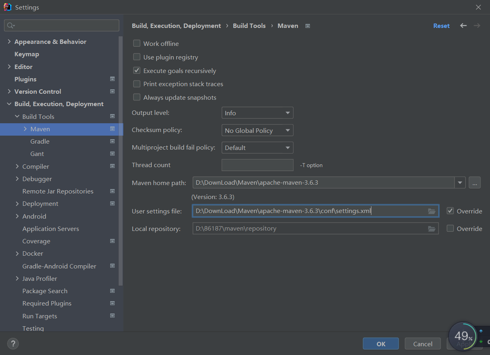
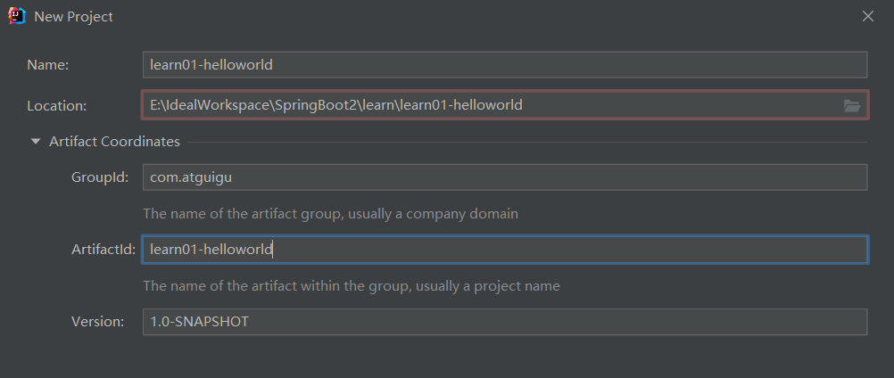

# 1.SpringBoot2 介绍

> [!NOTE] 温馨提示
> 转载请标注来源哦~~
> 
> 本文介绍 SpringBoot2 框架，你将学习到什么是 SpringBoot、如何编写第一个 SpringBoot 应用程序。文章内容来自站主大学时期的学习笔记。

Spring Boot底层是Spring Framework等技术栈，能快速创建出生产级别的Spring应用。

## 1.1SpringBoot优点

- Create stand-alone Spring applications

- - 创建独立Spring应用

- Embed Tomcat, Jetty or Undertow directly (no need to deploy WAR files)

- - 内嵌web服务器

- Provide opinionated 'starter' dependencies to simplify your build configuration

- - 自动starter依赖，简化构建配置

- Automatically configure Spring and 3rd party libraries whenever possible

- - 自动配置Spring以及第三方功能

- Provide production-ready features such as metrics, health checks, and externalized configuration

- - 提供生产级别的监控、健康检查及外部化配置

- Absolutely no code generation and no requirement for XML configuration

- - 无代码生成、无需编写XML

> SpringBoot是整合Spring技术栈的一站式框架
>
> SpringBoot是简化Spring技术栈的快速开发脚手架

## 1.2SpringBoot缺点

- 人称版本帝，迭代快，需要时刻关注变化
- 封装太深，内部原理复杂，不容易精通

# 2.SpingBoot2 入门

## 2.1系统要求

- [Java 8](https://www.java.com/) & 兼容java14 .
- Maven 3.3+（此处用3.6.3）
- idea 2019.1.2

maven配置settings.xml

```xml
<mirrors>
    <mirror>
      <id>nexus-aliyun</id>
      <mirrorOf>central</mirrorOf>
      <name>Nexus aliyun</name>
      <url>http://maven.aliyun.com/nexus/content/groups/public</url>
    </mirror>
</mirrors>
<!--使用jdk1.8进行项目编译-->
<profiles>
       <profile>
            <id>jdk-1.8</id>
            <activation>
              <activeByDefault>true</activeByDefault>
              <jdk>1.8</jdk>
            </activation>
            <properties>
              <maven.compiler.source>1.8</maven.compiler.source>
              <maven.compiler.target>1.8</maven.compiler.target>
              <maven.compiler.compilerVersion>1.8</maven.compiler.compilerVersion>
            </properties>
       </profile>
</profiles>
```

## 2.2HelloWorld

需求：浏览发送/hello请求，响应 Hello，Spring Boot 2 

### 2.2.1创建maven工程

先检查一下：



然后New Project-->选maven-->next



### 2.2.2引入依赖

注意：依赖加就行，别把原来默认存在的标签删掉！（可能出错）

要用SpringBoot

```xml
<parent>
    <groupId>org.springframework.boot</groupId>
    <artifactId>spring-boot-starter-parent</artifactId>
    <version>2.3.4.RELEASE</version>
</parent>
```

写的是web应用

```xml
<dependencies>
    <dependency>
        <groupId>org.springframework.boot</groupId>
        <artifactId>spring-boot-starter-web</artifactId>
    </dependency>
</dependencies>
```

### 2.2.3创建主程序

在java文件夹下创建com.atguigu.boot.MainApplication

```java
package com.atguigu.boot;

import org.springframework.boot.SpringApplication;
import org.springframework.boot.autoconfigure.SpringBootApplication;

/**
 * 主程序类（启动入口）
 * @SpringBootApplication:这是一个Spring Boot应用
 */
@SpringBootApplication
public class MainApplication {
    public static void main(String[] args) {
        //把主类加载进来
        SpringApplication.run(MainApplication.class,args);
    }
}
```

### 2.2.4编写业务

然后在boot下创建controller/HelloController.java

```java
package com.atguigu.boot.controller;

import org.springframework.stereotype.Controller;
import org.springframework.web.bind.annotation.RequestMapping;
import org.springframework.web.bind.annotation.ResponseBody;
import org.springframework.web.bind.annotation.RestController;

////返回字符串给浏览器要加这个（代表字符串直接写给浏览器，而不是跳转到某个页面）
//@ResponseBody
//@Controller
//@RestController包括上面那两个
@RestController
public class HelloController {
    //映射浏览器请求，处理
    @RequestMapping("/hello")
    public String handle01() {
        return "Hello, Spring Boot 2!";
    }
}
```

### 2.2.5测试

然后右键主程序类运行，浏览器访问8080端口http://localhost:8080/hello会出现“Hello, Spring Boot 2!”

### 2.2.6简化配置

SpringBoot可以将所有配置都放在resources文件夹下的application.properties文件中

```properties
#改端口号
server.port=8888
```

能配置什么：https://docs.spring.io/spring-boot/docs/current/reference/html/application-properties.html#appendix.application-properties

### 2.2.7简化部署

```xml
 <build>
    <plugins>
        <plugin>
            <groupId>org.springframework.boot</groupId>
            <artifactId>spring-boot-maven-plugin</artifactId>
            <!--<version>2.3.4.RELEASE</version>-->
        </plugin>
    </plugins>
</build>
```

这个插件可以把项目打成jar包，直接在目标服务器执行即可。（无需在目标服务器安装tomcat）【没有这个插件打成的jar包没有依赖，不能运行】

> 注意：这里可能会爆红
>
> 【原因】
>
> 没有制定maven-plugin的版本，这对导致编译环境（IDEA、命令行、maven插件等）认为找不到/无法解析该包，故报错。
>
> 这是IDEA、Maven插件检测的老问题，只是会给出错误提示，并**不影响**任何发布、运行。

步骤：

先clean再package打包；

然后在target文件夹下执行cmd

```bash
java -jar springboot01-helloworld-1.0-SNAPSHOT.jar
```

