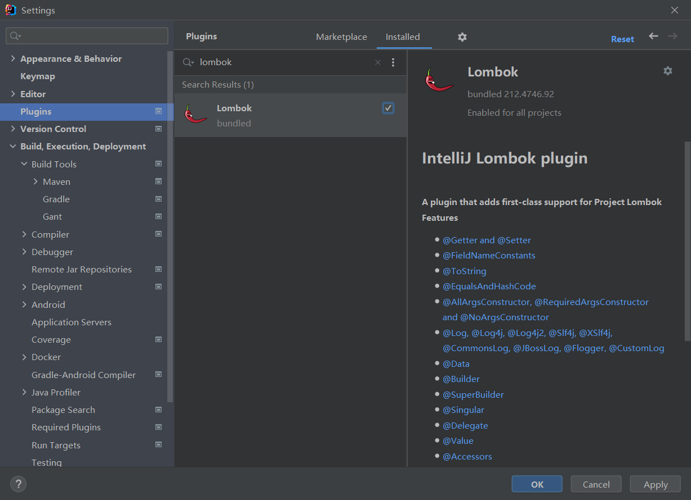
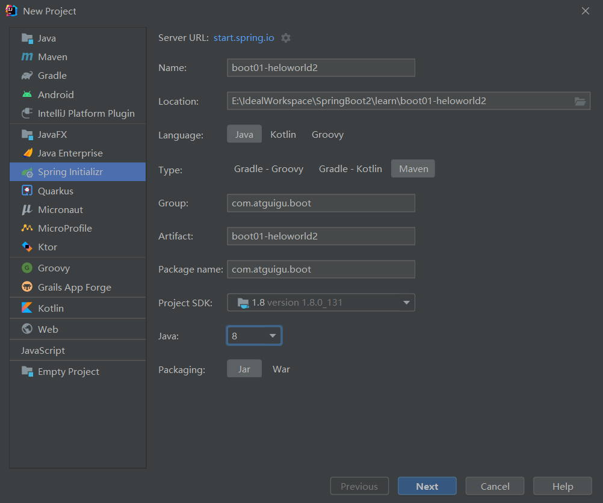
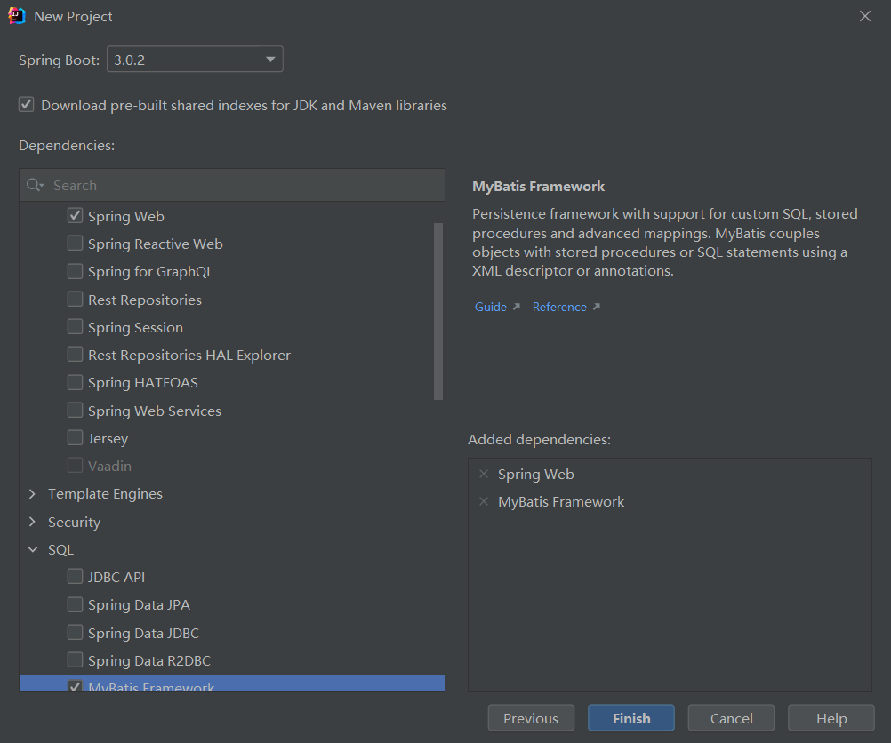
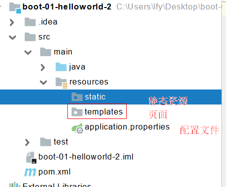

# 4.SpringBoot2 开发小技巧

> [!NOTE] 温馨提示
> 转载请标注来源哦~~
> 
> 本文介绍 SpringBoot2 开发小技巧，可以帮助我们简化开发。文章内容来自站主大学时期的学习笔记。

## 4.1Lombok

作用：（1）简化JavaBean开发（自动生成getter、setter、toString方法）

1、引入依赖

```xml
<dependency>
    <groupId>org.projectlombok</groupId>
    <artifactId>lombok</artifactId>
</dependency>
```

2、idea中搜索安装lombok插件



3、使用

```java
//@ToString
@Data
//@Component
@ConfigurationProperties(prefix = "mycar")
public class Car {
    private String brand;
    private Integer price;
}
```

@Data包含了@ToString

有的属性不想用构造方法，那就自己写：

```java
//@AllArgsConstructor
@NoArgsConstructor
@Data
public class User {
    private String name;
    private Integer age;
    private Pet pet;

    public User(String name, Integer age) {
        this.name = name;
        this.age = age;
    }
}
```

（2）简化日志开发@Slf4j：

```java
@RestController
@Slf4j
public class HelloController {

    //自动注入
    @Autowired
    Car car;

    @RequestMapping("/car")
    public Car car() {
        return car;
    }

    //映射浏览器请求，处理
    @RequestMapping("/hello")
    public String handle01(@RequestParam String name) {
        log.info("日志——请求。。。");
        return "Hello, Spring Boot 2!"+name;
    }
}
```

> 然后访问hello会打印日志

## 4.2dev-tools（热部署没必要）

```xml
<dependency>
    <groupId>org.springframework.boot</groupId>
    <artifactId>spring-boot-devtools</artifactId>
    <optional>true</optional>
</dependency>
```

这样的话，有修改，Ctrl+F9即可重新部署（没啥用）

静态页面就不用了

## 4.3Spring Initailizr（项目初始化向导）

1、创建初始化项目

2、选择我们需要的开发场景



3、它自动依赖引入、自动创建项目结构、自动编写好主配置类



