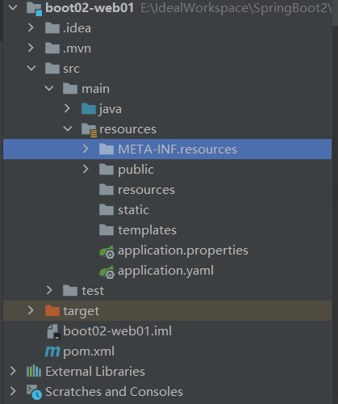
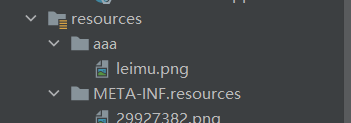
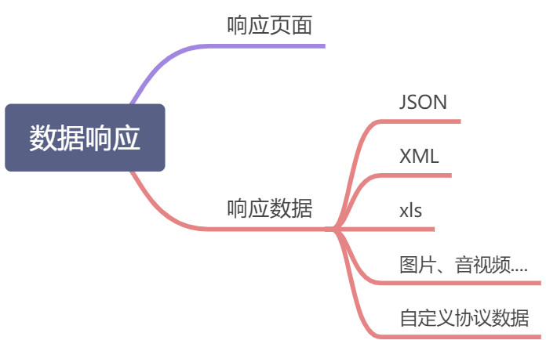
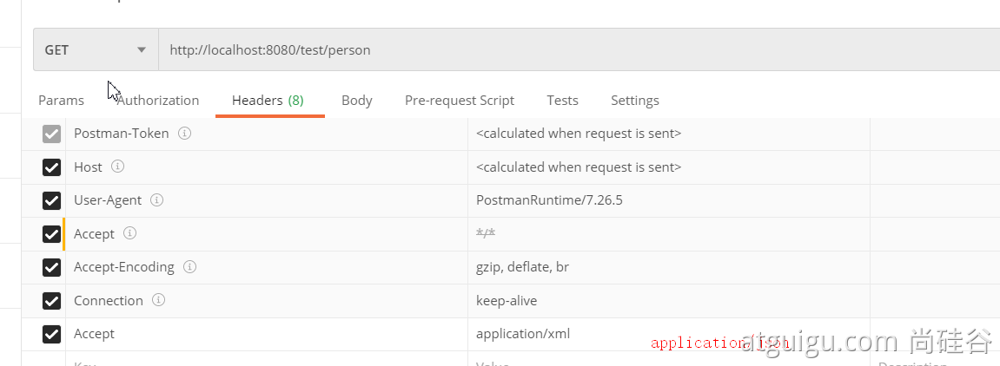
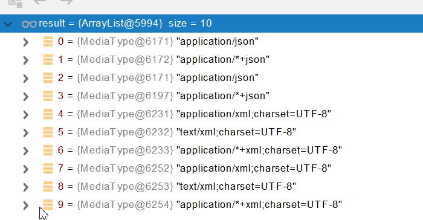

# 6.SpringBoot2 Web开发:基础

> [!NOTE] 温馨提示
> 转载请标注来源哦~~
> 
> 本文介绍 SpringBoot2 Web开发，你将学习到如何开发 Web 应用。文章内容来自站主大学时期的学习笔记。

## 6.1SpringMVC自动配置概览

Spring Boot provides auto-configuration for Spring MVC that **works well with most applications.(大多场景我们都无需自定义配置)**

The auto-configuration adds the following features on top of Spring’s defaults:

- Inclusion of `ContentNegotiatingViewResolver` and `BeanNameViewResolver` beans.

  - 内容协商视图解析器和BeanName视图解析器

- Support for serving static resources, including support for WebJars (covered [later in this document](https://docs.spring.io/spring-boot/docs/current/reference/html/spring-boot-features.html#boot-features-spring-mvc-static-content))).

  - 静态资源（包括webjars）

- Automatic registration of `Converter`, `GenericConverter`, and `Formatter` beans.

  - 自动注册 `Converter，GenericConverter，Formatter `

- Support for `HttpMessageConverters` (covered [later in this document](https://docs.spring.io/spring-boot/docs/current/reference/html/spring-boot-features.html#boot-features-spring-mvc-message-converters)).

  - 支持 `HttpMessageConverters` （后来我们配合内容协商理解原理）

- Automatic registration of `MessageCodesResolver` (covered [later in this document](https://docs.spring.io/spring-boot/docs/current/reference/html/spring-boot-features.html#boot-features-spring-message-codes)).

  - 自动注册 `MessageCodesResolver` （国际化用）

- Static `index.html` support.

  - 静态index.html 页支持

- Custom `Favicon` support (covered [later in this document](https://docs.spring.io/spring-boot/docs/current/reference/html/spring-boot-features.html#boot-features-spring-mvc-favicon)).

  - 自定义 `Favicon`  

- Automatic use of a `ConfigurableWebBindingInitializer` bean (covered [later in this document](https://docs.spring.io/spring-boot/docs/current/reference/html/spring-boot-features.html#boot-features-spring-mvc-web-binding-initializer)).

  - 自动使用 `ConfigurableWebBindingInitializer` ，（DataBinder负责将请求数据绑定到JavaBean上）

## 6.2简单功能分析

使用快速构建项目[SpringBoot 2 开发小技巧](#)，勾选Spring Web、Lombok、Spring Boot DevTools、Spring Configuration Processor

注意：pom文件的Spring Boot版本改成2.3.4

目录结构（没有的几个文件夹自己加）



### 1.静态资源访问

#### 1.1静态资源目录

只要静态资源放在类路径下： called `/static` (or `/public` or `/resources` or `/META-INF/resources`，都能访问。【注意这个resources是和static同级的那个resources】

访问 ： 当前项目根路径/ + 静态资源名
http://localhost:8080/leimu.png（不管放在那个目录下，几级都可以这样访问） 

原理： 静态映射/**（拦截所有请求）。**
**请求进来，**先去找Controller看能不能处理**。**不能处理的**所有请求**又都交给静态资源处理器**。静态资源也找不到则响应404页面

**改变默认的静态资源路径**

```yaml
spring:
  resources:
    static-locations: [classpath:/aaa/] #指定静态资源路径
```



这时候其他文件夹的静态资源无法访问，只能访问aaa的http://localhost:8080/leimu.png

改完重启 idea，可能会有缓存

#### 2.2静态资源访问前缀

一般希望静态资源访问路径有个前缀

默认无前缀

```yml
spring:
  mvc:
    static-path-pattern: /res/** #前缀 会导致欢迎页失效
```

访问：当前项目 + static-path-pattern + 静态资源名 = 静态资源文件夹下找
eg. http://localhost:8080/res/leimu.png

#### 2.3webjar

自动映射 /[webjars](http://localhost:8080/webjars/jquery/3.5.1/jquery.js)/**

https://www.webjars.org/

```xml
<dependency>
    <groupId>org.webjars</groupId>
    <artifactId>jquery</artifactId>
    <version>3.5.1</version>
</dependency>
```

访问地址：[http://localhost:8080/webjars/**jquery/3.5.1/jquery.js**](http://localhost:8080/webjars/jquery/3.5.1/jquery.js)   后面地址要按照依赖里面的包路径

2.7.5新版代码和现在不一样，前面要加一个web，直接先输入static等着代码补全就可以看到了

### 2.欢迎页支持

- 静态资源路径下  index.html

- - 可以配置静态资源路径
  - 但是不可以配置静态资源的访问前缀。否则导致 index.html不能被默认访问

- controller能处理/index

### 3.自定义 Favicon

favicon.ico 放在静态资源目录下即可。

完了要刷新：

*ctrl + F5* 是直接请求服务器的资源,让当前页面的资源重新全部从服务器上下载下来,这样就全部更新了

```yml
spring:
#  mvc:
#    static-path-pattern: /res/**   这个会导致 Favicon 功能失效
```

静态路径访问前缀也会影响这个

## 6.3请求参数处理

### 1.请求映射

#### 1.1rest使用

- @xxxMapping；

- Rest风格支持（*使用**HTTP**请求方式动词来表示对资源的操作*）

  - 以前：*/getUser*  *获取用户*    */deleteUser* *删除用户*   */editUser*  *修改用户*      */saveUser* *保存用户*
  - 现在： */user*    *GET-获取用户*    *DELETE-删除用户*     *PUT-修改用户*      *POST-保存用户*

使用示例：HelloController：

```java
    //@RequestMapping(value = "/user",method = RequestMethod.GET) // 以前
	@GetMapping("/user") // 现在
    public String getUser(){
        return "GET-张三";
    }

    //@RequestMapping(value = "/user",method = RequestMethod.POST)
	@PostMapping("/user")
    public String saveUser(){
        return "POST-张三";
    }


    //@RequestMapping(value = "/user",method = RequestMethod.PUT)
	@PutMapping("/user")
    public String putUser(){
        return "PUT-张三";
    }

    //@RequestMapping(value = "/user",method = RequestMethod.DELETE)
	@DeleteMapping("/user")
    public String deleteUser(){
        return "DELETE-张三";
    }
```

### 2.普通参数与基本注解

#### 2.1注解

@PathVariable（路径变量）、@RequestHeader（请求头参数）、@ModelAttribute、@RequestParam（请求query参数）、@MatrixVariable（矩阵变量）、@CookieValue（Cookie值）、@RequestBody（表单提交）

示例：

```java
@RestController
public class ParamTestController {

    //car/2/owner/lisi?age=18&&inters=basketball&inters=game
    @GetMapping("/car/{id}/owner/{username}")
    public Map<String,Object> getCar(@PathVariable("id") Integer id,
                                     @PathVariable("username") String username,
                                     @PathVariable Map<String,String> pv,
                                     @RequestHeader("user-Agent") String userAgent,
                                     @RequestHeader Map<String,String> headers,
                                     @RequestParam("age") Integer age,
                                     @RequestParam("inters") List<String> inters,
                                     @RequestParam Map<String,String> params,
                                     @CookieValue("Idea-2cfcebcc") String _ga,
                                     @CookieValue("Idea-2cfcebcc") Cookie cookie
                                     ){

        Map<String,Object> map = new HashMap<>();
        map.put("id",id);
        map.put("username",username);
        map.put("pv",pv);
        map.put("userAgent",userAgent);
        map.put("headers",headers);
        map.put("age",age);
        map.put("inters",inters);
        map.put("params",params);
        map.put("Idea-2cfcebcc",_ga);
        System.out.println(cookie.getName()+"===>"+cookie.getValue());
        return map;
    }
    @PostMapping("/save")
    public Map postMethod(@RequestBody String content){
        Map<String,Object> map = new HashMap<>();
        map.put("content",content);
        return map;
    }
}

```

> 注：用Map获取所有的时候会有问题，key不能重复
> 
> http://localhost:8080/car/2/owner/lisi?age=18&&inters=basketball&inters=game
> 
> {"inters":["basketball"],"params":{"age":"18","inters":"basketball","game":""}}

表单提交：

```html
<form action="/save" method="post">
    username:<input name="username"/><br>
    email:<input name="email">
    <input type="submit" value="submit">
</form>
```

#### 2.2自定义对象参数

可以自动类型转换与格式化，可以级联封装。

1、定义两个bean和页面

```java
@Data
public class Person {
    
    private String userName;
    private Integer age;
    private Date birth;
    private Pet pet;
    
}
```

```java
@Data
public class Pet {

    private String name;
    private String age;

}
```

```html
<form action="/saveuser" method="post">
    姓名： <input name="userName"/> <br/>
    年龄： <input name="age"/> <br/>
    生日： <input name="birth"/> <br/>
    宠物姓名：<input name="pet.name"/><br/>
    宠物年龄：<input name="pet.age"/>
    <input type="submit" value="submit">
</form>
```

2、Controller

数据绑定：页面提交的请求（get/post）都可以和对象属性进行绑定

```java
@PostMapping("/saveuser")
public Person saveuser(Person person){
    return person;
}
```

#### 2.3自定义Converter

接上，如果要求pet字段这样一次性输入`xiaomao,3`，然后后端封装成Pet对象：

```html
<form action="/saveuser" method="post">
    name: <input name="userName"/> <br/>
    age: <input name="age"/> <br/>
    birth:  <input name="birth"/> <br/>
<!--    宠物姓名：<input name="pet.name"/><br/>-->
<!--    宠物年龄：<input name="pet.age"/>-->
    pet: <input name="pet" />
    <input type="submit" value="submit">
</form>
```

在boot/config/WebConfig里配置：

```java
@Configuration(proxyBeanMethods = false)
public class WebConfig /*implements WebMvcConfigurer*/ {

    @Bean
    public WebMvcConfigurer webMvcConfigurer(){
        return new WebMvcConfigurer() {

            //配置自定义Converter
            @Override
            public void addFormatters(FormatterRegistry registry) {
                registry.addConverter(new Converter<String, Pet>() {
                    @Override
                    public Pet convert(String s) {
                        //mao,3
                        if(!StringUtils.isEmpty(s)){
                            Pet pet = new Pet();
                            String[] split = s.split(",");
                            pet.setName(split[0]);
                            pet.setAge(split[1]);
                            return pet;
                        }
                        return null;
                    }
                });
            }
        };
    }
}
```

## 6.4数据响应与内容协商





### 1.响应JSON

#### 1.1jackson.jar+@ResponseBody

要引入Web场景

```xml
<dependency>
    <groupId>org.springframework.boot</groupId>
    <artifactId>spring-boot-starter-web</artifactId>
</dependency>
```

web场景自动引入了json场景

```xml
<dependency>
  <groupId>org.springframework.boot</groupId>
  <artifactId>spring-boot-starter-json</artifactId>
  <version>2.3.4.RELEASE</version>
  <scope>compile</scope>
</dependency>
```

Controller

```java
@Controller
public class ResponseTestController {
    @ResponseBody //利用返回值处理器里的消息转换器处理
    @GetMapping("/test/person")
    public Person getPerson(){
        Person person = new Person();
        person.setAge(14);
        person.setUsername("zhangsan");
        return person;
    }
}
```

> 引入场景启动器，再用@ResponseBody注解，给前端自动返回JSON数据

### 2.内容协商

根据客户端接收能力不同，返回不同媒体类型的数据。

#### 1、引入xml依赖

支持返回xml的依赖

```xml
<dependency>
   <groupId>com.fasterxml.jackson.dataformat</groupId>
   <artifactId>jackson-dataformat-xml</artifactId></dependency>
```

#### 2、postman分别测试返回json和xml

只需要改变请求头中Accept字段。Http协议中规定的，告诉服务器本客户端可以接收的数据类型。



#### 3、开启浏览器参数方式内容协商功能

#### 4、内容协商原理

- 1、判断当前响应头中是否已经有确定的媒体类型。MediaType

- **2、获取客户端（PostMan、浏览器）支持接收的内容类型。（获取客户端Accept请求头字段）【application/xml】**

- 3、遍历循环所有当前系统的 **MessageConverter**，看谁支持操作这个对象（Person）

- 4、找到支持操作Person的converter，把converter支持的媒体类型统计出来。

- 5、客户端需要【application/xml】。服务端能力【10种、json、xml】

  

- 6、进行内容协商的最佳匹配媒体类型

- 7、用 支持 将对象转为 最佳匹配媒体类型 的converter。调用它进行转化 。
