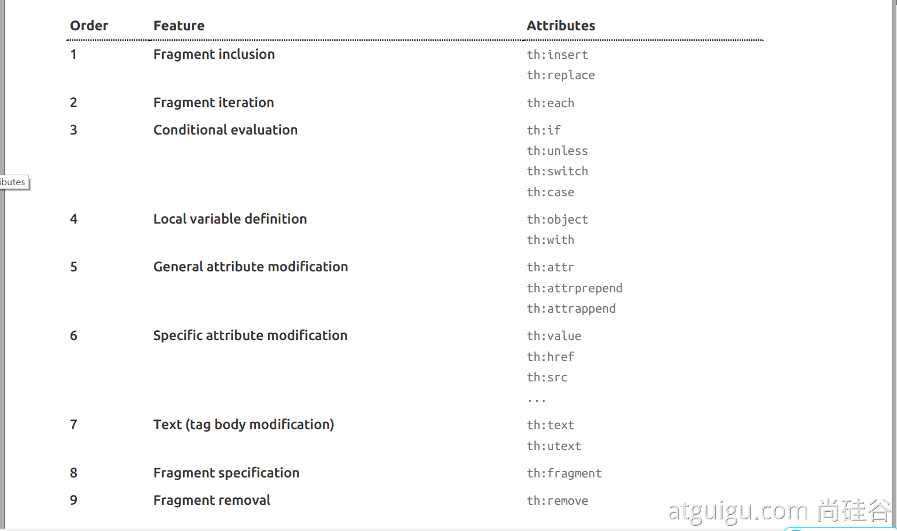
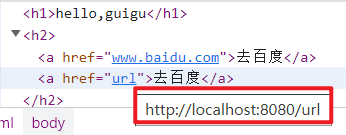

# 6.SpringBoot2 Web开发:模板引擎

> [!NOTE] 温馨提示
> 转载请标注来源哦~~
> 
> 本文介绍 Thymeleaf 模板引擎，你将学习到如何开发 Thymeleaf 前端页面。文章内容来自站主大学时期的学习笔记。

## 6.5视图解析与模板引擎

视图解析：**SpringBoot默认不支持 JSP，需要引入第三方模板引擎技术实现页面渲染。**

### 1.模板引擎-Thymeleaf

#### 1.thymeleaf简介

Thymeleaf is a modern server-side Java template engine for both web and standalone environments, capable of processing HTML, XML, JavaScript, CSS and even plain text.

**现代化、服务端Java模板引擎**

面向后端人员，所以简单，复杂页面还要前后端分离

#### 2.基本语法

##### 2.1表达式

| 表达式名字 | 语法    | 用途                               |
| ---------- | ------- | ---------------------------------- |
| 变量取值   | ${...}  | 获取请求域、session域、对象等值    |
| 选择变量   | *{...}  | 获取上下文对象值                   |
| 消息       | \#{...} | 获取国际化等值                     |
| 链接       | @{...}  | 生成链接                           |
| 片段表达式 | ~{...}  | jsp:include 作用，引入公共页面片段 |

##### 2.2字面量

文本值: **'one text'** **,** **'Another one!'** **,…**数字: **0** **,** **34** **,** **3.0** **,** **12.3** **,…**布尔值: **true** **,** **false**

空值: **null**

变量： one，two，.... 变量不能有空格

##### 2.3文本操作

字符串拼接: **+**

变量替换: **|The name is ${name}|** 

##### 2.4数学运算

运算符: + , - , * , / , %

##### 2.5布尔运算

运算符:  **and** **,** **or**

一元运算: **!** **,** **not** 

##### 2.6比较运算

比较: **>** **,** **<** **,** **>=** **,** **<=** **(** **gt** **,** **lt** **,** **ge** **,** **le** **)**等式: **==** **,** **!=** **(** **eq** **,** **ne** **)** 

##### 2.7条件运算

If-then: **(if) ? (then)**

If-then-else: **(if) ? (then) : (else)**

Default: (value) **?: (defaultvalue)** 

##### 2.8特殊操作

无操作： _

#### 3.设置属性值-th:attr

设置单个值

```html
<form action="subscribe.html" th:attr="action=@{/subscribe}">
  <fieldset>
    <input type="text" name="email" />
    <input type="submit" value="Subscribe!" th:attr="value=#{subscribe.submit}"/>
  </fieldset>
</form>
```

设置多个值

```html

```


以上两个的代替写法 th:xxxx

```html
<input type="submit" value="Subscribe!" th:value="#{subscribe.submit}"/>
<form action="subscribe.html" th:action="@{/subscribe}">
```


所有h5兼容的标签写法

https://www.thymeleaf.org/doc/tutorials/3.0/usingthymeleaf.html#setting-value-to-specific-attributes


#### 4.迭代

```html
<tr th:each="prod : ${prods}">
        <td th:text="${prod.name}">Onions</td>
        <td th:text="${prod.price}">2.41</td>
        <td th:text="${prod.inStock}? #{true} : #{false}">yes</td>
</tr>
```


```html
<tr th:each="prod,iterStat : ${prods}" th:class="${iterStat.odd}? 'odd'">
  <td th:text="${prod.name}">Onions</td>
  <td th:text="${prod.price}">2.41</td>
  <td th:text="${prod.inStock}? #{true} : #{false}">yes</td>
</tr>
```


#### 5.条件运算

```html
<a href="comments.html"
th:href="@{/product/comments(prodId=${prod.id})}"
th:if="${not #lists.isEmpty(prod.comments)}">view</a>
```

```html
<div th:switch="${user.role}">
  <p th:case="'admin'">User is an administrator</p>
  <p th:case="#{roles.manager}">User is a manager</p>
  <p th:case="*">User is some other thing</p>
</div>
```

#### 6.属性优先级




### 2.thymeleaf使用

#### 1.引入Starter

```xml
<dependency>
    <groupId>org.springframework.boot</groupId>
    <artifactId>spring-boot-starter-thymeleaf</artifactId>
</dependency>
```

#### 2.自动配置好了thymeleaf

```java
@Configuration(proxyBeanMethods = false)
@EnableConfigurationProperties(ThymeleafProperties.class)
@ConditionalOnClass({ TemplateMode.class, SpringTemplateEngine.class })
@AutoConfigureAfter({ WebMvcAutoConfiguration.class, WebFluxAutoConfiguration.class })
public class ThymeleafAutoConfiguration { }
```

自动配好的策略

- 1、所有thymeleaf的配置值都在 ThymeleafProperties
- 2、配置好了 **SpringTemplateEngine** 模板引擎
- **3、配好了** **ThymeleafViewResolver** 视图解析器
- 4、我们只需要直接开发页面

```java
public static final String DEFAULT_PREFIX = "classpath:/templates/";

public static final String DEFAULT_SUFFIX = ".html";  //xxx.html
```

写的页面放到classpath:/templates/

#### 3.页面开发

要加上这个：`xmlns:th="http://www.thymeleaf.org"`（写代码有提示）

```html
<!DOCTYPE html>
<html lang="en" xmlns:th="http://www.thymeleaf.org">
<head>
    <meta charset="UTF-8">
    <title>Title</title>
</head>
<body>
<h1 th:text="${msg}">哈哈</h1>
<h2>
    <a href="www.atguigu.com" th:href="${link}">去百度</a>  <br/>
    <a href="www.atguigu.com" th:href="@{link}">去百度2</a>
</h2>
</body>
</html>
```

```java
@Controller
public class ViewTestController {

    @GetMapping("/atguigu")
    public String atguigu(Model model){
        //model中的数据会被放在请求域中
        model.addAttribute("msg","hello,guigu");
        model.addAttribute("link","http://www.baidu.com");
        //路径前后缀都配好了，不用加.html
        return "success";
    }
}
```

> 这样写的页面有默认值

href中@{link}会自动拼接到当前url后（相对路径）



@{/link}绝对路径（/link）
