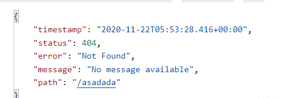
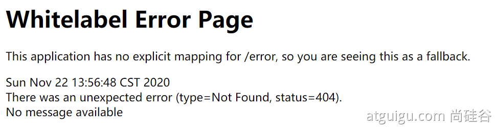
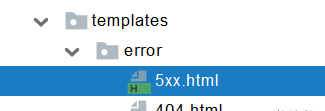
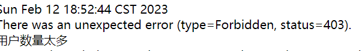

# 6.SpringBoot2 Web开发:进阶

> [!NOTE] 温馨提示
> 转载请标注来源哦~~
> 
> 本文介绍 SpringBoot2 Web开发进阶内容，你将学习到如何使用拦截器、进行文件上传、异常处理。文章内容来自站主大学时期的学习笔记。

## 6.6拦截器

### 1.HandlerInterceptor 接口

Interceptor/LoginInterceptor

```java
/**
 * 登录检查
 * 1、配置好拦截器要拦截哪些请求
 * 2、把这些配置放在容器中
 */
@Slf4j
public class LoginInterceptor implements HandlerInterceptor {

    /**
     * 目标方法执行之前
     * @param request
     * @param response
     * @param handler
     * @return
     * @throws Exception
     */
    @Override
    public boolean preHandle(HttpServletRequest request, HttpServletResponse response, Object handler) throws Exception {

        String requestURI = request.getRequestURI();
        log.info("preHandle拦截的请求路径是{}",requestURI);

        //登录检查逻辑
        HttpSession session = request.getSession();

        Object loginUser = session.getAttribute("loginUser");

        if(loginUser != null){
            //放行
            return true;
        }

        //拦截住。未登录。跳转到登录页
        request.setAttribute("msg","请先登录");
//        re.sendRedirect("/");
        request.getRequestDispatcher("/").forward(request,response);
        return false;
    }

    /**
     * 目标方法执行完成以后
     * @param request
     * @param response
     * @param handler
     * @param modelAndView
     * @throws Exception
     */
    @Override
    public void postHandle(HttpServletRequest request, HttpServletResponse response, Object handler, ModelAndView modelAndView) throws Exception {
        log.info("postHandle执行{}",modelAndView);
    }

    /**
     * 页面渲染以后
     * @param request
     * @param response
     * @param handler
     * @param ex
     * @throws Exception
     */
    @Override
    public void afterCompletion(HttpServletRequest request, HttpServletResponse response, Object handler, Exception ex) throws Exception {
        log.info("afterCompletion执行异常{}",ex);
    }
}
```

### 2.配置拦截器

config/AdminWebConfig

```java
/**
 * 1、编写一个拦截器实现HandlerInterceptor接口
 * 2、拦截器注册到容器中（实现WebMvcConfigurer的addInterceptors）
 * 3、指定拦截规则【如果是拦截所有，静态资源也会被拦截】
 */
@Configuration
public class AdminWebConfig implements WebMvcConfigurer {

    @Override
    public void addInterceptors(InterceptorRegistry registry) {
        registry.addInterceptor(new LoginInterceptor())
                .addPathPatterns("/**")  //所有请求都被拦截包括静态资源
                .excludePathPatterns("/","/login","/css/**","/fonts/**","/images/**","/js/**"); //放行的请求
    }
}
```

## 6.7文件上传

### 1、页面表单

```html
<form role="form" th:action="@{/upload}" method="post" enctype="multipart/form-data">

	<!-- 单文件上传-->
	<div class="form-group">
	    <label for="exampleInputFile">头像</label>
	    <input type="file" name="headerImg" id="exampleInputFile">
	</div>
	<!-- 多文件上传-->
	<div class="form-group">
	    <label for="exampleInputFile">生活照</label>
	    <input type="file" name="photos" multiple>
	</div>
</form>
```

### 2、文件上传代码

```java
//MultipartFile 自动封装上传过来的文件【图片、视频、文件都可】
@PostMapping("/upload")
public String upload(@RequestParam("email") String email,
                     @RequestParam("username") String username,
                     @RequestPart("headerImg") MultipartFile headerImg,
                     @RequestPart("photos") MultipartFile[] photos) throws IOException {
    log.info("上传的信息：email={}，username={}，headerImg={}，photos={}",
            email,username,headerImg.getSize(),photos.length);

    //单文件
    if(!headerImg.isEmpty()){
        //保存到文件服务器，OSS服务器
        String originalFilename = headerImg.getOriginalFilename();
        //保存到磁盘
        headerImg.transferTo(new File("D:\\linshi\\temp\\"+originalFilename));
    }
    //多文件
    if(photos.length > 0){
        for (MultipartFile photo : photos) {
            if(!photo.isEmpty()){
                String originalFilename = photo.getOriginalFilename();
                photo.transferTo(new File("D:\\linshi\\temp\\"+originalFilename));
            }
        }
    }
    return "main";
}
```

## 6.8异常处理

### 1、错误处理默认规则

- 默认情况下，Spring Boot提供`/error`处理所有错误的映射
- 对于机器客户端，它将生成JSON响应，其中包含错误，HTTP状态和异常消息的详细信息。
- 对于浏览器客户端，响应一个“ whitelabel”错误视图，以HTML格式呈现相同的数据






- **要对其进行自定义，添加** **`View`** **解析为** **`error`**
- 要完全替换默认行为，可以实现 `ErrorController `并注册该类型的Bean定义，或添加`ErrorAttributes类型的组件`以使用现有机制但替换其内容。
- error/下的4xx，5xx页面会被自动解析；

  - 


### 2、定制错误处理逻辑

- 自定义错误页

  - error/404.html   error/5xx.html；有**精确的错误状态码页面就匹配精确**，**没有就找 4xx.html**；如果**都没有就触发白页**

- ```java
  /**
   * 处理 整个Web Controller的异常
   */
  @Slf4j
  @Controller
  public class GlobalExceptionHandler {
      @ExceptionHandler({ArithmeticException.class,NullPointerException.class})
      public String HandleArithException(Exception e){
          log.error("异常是：{}",e);
          return "login";
      }
  }
  ```

- @ControllerAdvice+@ExceptionHandler处理全局异常；底层是 **ExceptionHandlerExceptionResolver 支持的**

  - **【自定义异常】**

  - ```java
    package com.atguigu.admin.exception;
    @ResponseStatus(value = HttpStatus.FORBIDDEN,reason = "用户数量太多")
    public class UserTooMuchException extends RuntimeException{
        //构造方法
        public UserTooMuchException(){}
        public UserTooMuchException(String message){
            super(message);
        }
    }
    ```

  - ```java
        @GetMapping("/dynamic_table")
        public String dynamic_table(Model model){
            List<User> users = Arrays.asList(new User("zhangsan", "123456"),
                    new User("lisi", "123444"),
                    new User("haha", "aaaaa"),
                    new User("hehe ", "aaddd"));
            model.addAttribute("users",users);
            if(users.size()>3){
                throw new UserTooMuchException();
            }
            return "table/dynamic_table";
        }
    ```

  - 

