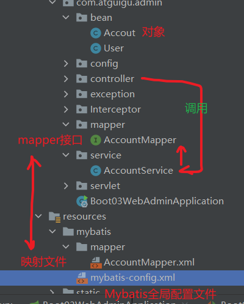
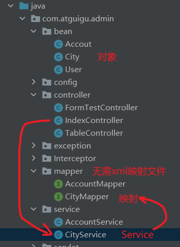
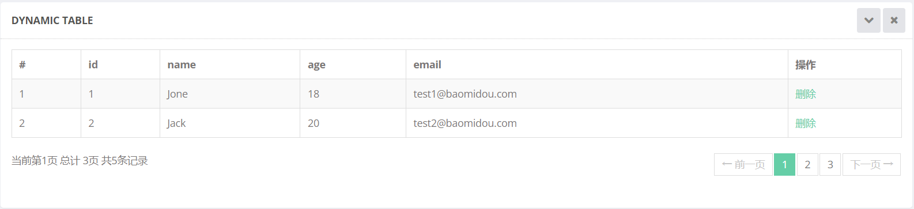

# 7.SpringBoot2 数据访问

> [!NOTE] 温馨提示
> 转载请标注来源哦~~
> 
> 本文介绍 SpringBoot2 数据访问方式，你将学习到如何集成 MyBatis 与 MyBatisPlus 进行数据库操作。文章内容来自站主大学时期的学习笔记。

数据存储方式有很多，例如 MySQL、Oracle、MongoDB、Redis 等等，这里我们以 MySQL 为例进行介绍。

## 7.1 SQL

### 1.整合MyBatis操作

前面用的`JdbcTemplate`是spring boot官方的，我们用`MyBatis`

**整合第三方技术：找starter（场景启动器）+写配置yml**。

SpringBoot官方的Starter：spring-boot-starter-*

第三方的： *-spring-boot-starter

[druid和mybatis关系](https://blog.csdn.net/qq_42146775/article/details/106603082#:~:text=mybatis让,里面拿一个就行.)

#### 1.1引入依赖

```xml
<dependency>
    <groupId>org.mybatis.spring.boot</groupId>
    <artifactId>mybatis-spring-boot-starter</artifactId>
    <version>2.1.4</version>
</dependency>
```

MyBatis 的使用方式有三种，分别是：配置模式、注解模式、混合模式，下面分别进行介绍。

#### 1.2配置模式(法1)

- 全局配置文件
- SqlSessionFactory: 自动配置好了
- SqlSession：自动配置了 **SqlSessionTemplate 组合了SqlSession**
- @Import(**AutoConfiguredMapperScannerRegistrar**.**class**）；
- Mapper： 只要我们写的操作MyBatis的接口标注了 @Mapper注解 就会被自动扫描进来



上图：controller调service，service调mapper。

yml

```yml
# 配置Mybatis规则
mybatis:
  config-location: classpath:mybatis/mybatis-config.xml # 全局配置文件位置
  mapper-locations: classpath:mybatis/mapper/*.xml # sql映射文件位置
```

AccountMapper接口

```java
@Mapper
public interface AccountMapper {

    public Accout getAccount(Long id);
}
```

映射文件

```xml
<?xml version="1.0" encoding="UTF-8" ?>
<!DOCTYPE mapper
        PUBLIC "-//mybatis.org//DTD Mapper 3.0//EN"
        "http://mybatis.org/dtd/mybatis-3-mapper.dtd">

<mapper namespace="com.atguigu.admin.mapper.AccountMapper">
<!--    public Accout getAccount(Long id);-->
    <select id="getAccount" resultType="com.atguigu.admin.bean.Accout">
        select * from account where id=#{}
    </select>
</mapper>
```

Mybatis全局配置文件

```xml
<?xml version="1.0" encoding="UTF-8" ?>
<!DOCTYPE configuration
        PUBLIC "-//mybatis.org//DTD Mapper 3.0//EN"
        "http://mybatis.org/dtd/mybatis-3-config.dtd">
<configuration>
    <settings>
<!--        配置驼峰命名（数据库属性如果用的是下划线，bean用的是驼峰，则会映射失败）【我的数据库可无】-->
        <setting name="mapUnderscoreToCamelCase" value="true"/>
    </settings>
</configuration>
```

**测试**：

```java
@Autowired
AccountService accountService;

@GetMapping("/getAccount")
public Accout getAccountById(@RequestParam("id") Long id){
    return accountService.getAccountById(id);
}
```

**改进**：

配置 private Configuration configuration; **mybatis.configuration**下面的所有，就是相当于改**mybatis全局配置文件**中的值：

```yml
# 配置mybatis规则
mybatis:
#  config-location: classpath:mybatis/mybatis-config.xml
  mapper-locations: classpath:mybatis/mapper/*.xml
  configuration: # 指定Mybatis全局配置文件中相关配置项
    map-underscore-to-camel-case: true
```

可以不写全局配置文件，所有全局配置文件的配置都放在configuration配置项中即可，但是要把`config-location`注释掉（全局配置文件只能有一个）。

**配置小结**：

- 导入mybatis官方starter
- 编写mapper接口。标准@Mapper注解
- 编写sql映射文件并绑定mapper接口
- 在application.yaml中指定Mapper配置文件的位置，以及指定全局配置文件的信息 （建议；**配置在mybatis.configuration**）


#### 1.3注解模式(法2)

公司还是xml用的多一点，便于维护。
主要是因为注解只适合小型的sql语句，而公司里的语句都非常长，用xml配置会更清晰



Mapper接口

> SQL语句直接用注解写，无需xml映射文件

```java
@Mapper
public interface CityMapper {

    @Select("select * from city where id=#{id}")
    public City getCityById(Long id);
}
```

Service

```java
@Service
public class CityService {

    @Autowired
    CityMapper cityMapper;

    public City getCityById(Long id){
        return cityMapper.getCityById(id);
    }
}
```

Controller

```java
@Autowired
CityService cityService;
@ResponseBody
@GetMapping("/getCity")
public City getCityById(@RequestParam("id") Long id){
    return cityService.getCityById(id);
}
```

#### 1.4混合模式

Mapper接口

```java
@Mapper
public interface CityMapper {

    @Select("select * from city where id=#{id}")
    public City getCityById(Long id);

    public void insertCity(City city);
}
```

xml映射文件

```xml
<mapper namespace="com.atguigu.admin.mapper.CityMapper">
    <!--   public void insertCity(City city);-->
    <insert id="insertCity">
        insert into city(`name`,`state`,`country`)
        values(#{name},#{state},#{country})
    </insert>
</mapper>
```

Service

```java
@Service
public class CityService {

    @Autowired
    CityMapper cityMapper;

    public City getCityById(Long id){
        return cityMapper.getCityById(id);
    }

    public void insertCity(City city){
        cityMapper.insertCity(city);
    }
}
```

Controller

```java
@ResponseBody
@PostMapping("/insertCity")
public City getCityById(City city){
    cityService.insertCity(city);
    return city;
}
```

**测试（用postman发post请求）**：

失败

自动将自增主键的值放入传入的对象：

```xml
<mapper namespace="com.atguigu.admin.mapper.CityMapper">
    <!--   public void insertCity(City city);-->
    <insert id="insertCity" useGeneratedKeys="true" keyProperty="id">
        insert into city(`name`,`state`,`country`)
        values(#{name},#{state},#{country})
    </insert>
</mapper>
```

#相当于? $相当于直接拼接。所以$会有SQL注入问题。

如果上面的也要写成注解：Mapper接口

```java
@Insert("insert into city(`name`,`state`,`country`) values(#{name},#{state},#{country})")
@Options(useGeneratedKeys = true,keyProperty = "id")
public void insertCity(City city);
```


**小结最佳实战：**

- 引入mybatis-starter
- **配置application.yaml中，指定mapper-location位置即可**
- 编写Mapper接口并标注@Mapper注解
- **简单方法直接注解方式**
- **复杂方法编写mapper.xml进行绑定映射**
- *@MapperScan("com.atguigu.admin.mapper") 简化，其他的接口就可以不用标注@Mapper注解*

### 2.整合 MyBatis-Plus 完成CRUD

#### 2.1什么是MyBatis-Plus

[MyBatis-Plus](https://github.com/baomidou/mybatis-plus)（简称 MP）是一个 [MyBatis](http://www.mybatis.org/mybatis-3/) 的增强工具，在 MyBatis 的基础上只做增强不做改变，为简化开发、提高效率而生。基本的增删改查帮你写好了。

[mybatis plus 官网](https://baomidou.com/)

建议安装 **MybatisX** 插件 


#### 2.2整合MyBatis-Plus

##### 1.引入依赖

```xml
<dependency>
    <groupId>com.baomidou</groupId>
    <artifactId>mybatis-plus-boot-starter</artifactId>
    <version>3.4.1</version>
</dependency>
```

这个里面引入了好多东西，下面这个就不要了，注释掉

```
<dependency>
    <groupId>org.mybatis.spring.boot</groupId>
    <artifactId>mybatis-spring-boot-starter</artifactId>
    <version>2.1.4</version>
</dependency>
```

##### 2.使用

(1)准备对象

```java
@Data
@TableName("user")
public class User {
    //所有属性都应该在数据库中有，此注解表示属性不在表中
    @TableField(exist = false)
    private String userName;
    @TableField(exist = false)
    private String password;

    //以下是数据库字段
    private Long id;
    private String name;
    private Integer age;
    private String email;
}
```

> @TableField(exist = false) 此注解表示属性不在表中
>
> @TableName("user")表示表名，当修改表名时用

(2)Mapper接口继承`BaseMapper<T>`（Dao就是Mapper）

```java
@Mapper
public interface UserMapper extends BaseMapper<User> {
}
```

(3)测试类

```java
@Test
void testUserMapper(){
    User user = userMapper.selectById("1");
    log.info("用户信息：{}",user);
}
```


##### 3.CRUD功能

CRUD是做计算处理时的增加(Create)、读取查询(Retrieve)、更新(Update)和删除(Delete)几个单词的首字母简写。

(1)User对象

```java
@Data
@TableName("user")
public class User {
    //所有属性都应该在数据库中有，此注解表示属性不在表中
    @TableField(exist = false)
    private String userName;
    @TableField(exist = false)
    private String password;

    //以下是数据库字段
    private Long id;
    private String name;
    private Integer age;
    private String email;
}
```

(2)Mapper

```java
@Mapper
public interface UserMapper extends BaseMapper<User> {
}
```

(3)Service接口继承`IService<T>`

```java
public interface UserService extends IService<User> {
}
```

(4)ServiceImpl实现类继承`ServiceImpl<T>`

```java
@Service
public class UserServiceImpl extends ServiceImpl<UserMapper, User> implements UserService {
}
```

(5)Controller使用

```java
@GetMapping("/dynamic_table")
public String dynamic_table(@RequestParam(value = "pn",defaultValue = "1") Integer pn,
                                Model model){

    //从数据库查出user表数据展示
//    List<User> list = userService.list(); //查询所有
//    model.addAttribute("users",list);

    //分页查询数据
    Page<User> userPage = new Page<>(pn, 2);
    Page<User> page = userService.page(userPage, null);
//    long current = page.getCurrent(); //当前页
//    long pages = page.getPages(); //总共多少页
//    long total = page.getTotal(); //总共几条记录
//    List<User> records = page.getRecords();

    model.addAttribute("page",page);
    return "table/dynamic_table";
}

// 删除功能
@GetMapping("/user/delete/{id}")
public String deleteUser(@PathVariable("id") Long id,
                         @RequestParam(value = "pn",defaultValue = "1") Integer pn,
                         RedirectAttributes redirectAttributes){

    userService.removeById(id);
    redirectAttributes.addAttribute("pn",pn); //重定向参数
    return "redirect:/dynamic_table";
}
```

(6)分页器配置类

```java
@Configuration
public class MybatisConfig {

    @Bean
    public MybatisPlusInterceptor mybatisPlusInterceptor(){
        MybatisPlusInterceptor mybatisPlusInterceptor = new MybatisPlusInterceptor();

        //分页拦截器
        PaginationInnerInterceptor innerInterceptor = new PaginationInnerInterceptor();
        innerInterceptor.setOverflow(true); //最后一页时true跳回到首页，false继续请求
        innerInterceptor.setMaxLimit(50L); //每页最大数量 -1 不受限制
        mybatisPlusInterceptor.addInnerInterceptor(innerInterceptor);
        return mybatisPlusInterceptor;
    }
}
```

(7)模板示例

```html
<tr class="gradeX" th:each="user,stat: ${page.records}">
    <td th:text="${stat.count}"></td>
    <td th:text="${user.id}"></td>
    <td>[[${user.name}]]</td>
    <td th:text="${user.age}">Win 95+</td>
    <td th:text="${user.email}">4</td>
    <td>
        <a th:href="@{/user/delete/{id}(id=${user.id},pn=${users.current})}"
           class="btn btn-danger btn-sm" type="button">删除</a>
    </td>
</tr>
```

```html
<div class="dataTables_info" id="dynamic-table_info">
    当前第[[${page.current}]]页 总计 [[${page.pages}]]页 共[[${page.total}]]条记录
</div>
```

```html
<ul>
    <li class="prev disabled"><a href="#">← 前一页</a></li>
    <li th:class="${num == page.current?'active':''}"
        th:each="num:${#numbers.sequence(1,page.pages)}">
        <a th:href="@{/dynamic_table(pn=${num})}">[[${num}]]</a>
    </li>
    <li class="next disabled"><a href="#">下一页 → </a></li>
</ul>
```

展示




